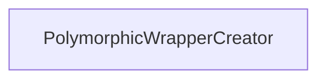

| public |
{:.api_label}

#### Inheritance Graph

## Description

[Generic](classUtil_1_1Generic) creator for wrapper objects.

This functor takes an object of type*InternalBaseType*. By using RTTI, it checks if the object is of subtype*InternalDerivedType*. If this is the case, it returns a new wrapper of type*WrapperDerivedType*with the object as constructor parameter.

> **Note**: Only use this creator for polymorphic types*InternalBaseType*and*InternalDerivedType*.

#### Parameters
**InternalBaseType**
:  Base type of internal objects that are given to the creator

**InternalDerivedType**
:  Concrete type of internal objects for which a wrapper shall be created

**WrapperDerivedType**
:  Concrete type of wrapper object that will be created

**Author**: Benjamin Eikel

**Date**: 2012-01-31

## Public Functions

|
| ------: | ----------------- |
|  | |
| WrapperDerivedType * | **[operator()](#classUtil_1_1PolymorphicWrapperCreator_1a4a2b110bce5c905cf77cbfa4a2d92f0e)**(InternalBaseType * baseObject) |
{: .nohead .nowrap1 .api_section }

-------------------------------------------------------------------

## Documentation

### <small>function</small>  Util::PolymorphicWrapperCreator::operator() {#classUtil_1_1PolymorphicWrapperCreator_1a4a2b110bce5c905cf77cbfa4a2d92f0e}

| public | inline |
{:.api_label}

|
| ------: | ----------------- |
|  |
| WrapperDerivedType * **[operator()](#classUtil_1_1PolymorphicWrapperCreator_1a4a2b110bce5c905cf77cbfa4a2d92f0e)**( | InternalBaseType * | **baseObject** ) |
{: .nohead .nowrap1 .api_doc }

Defined in `Util/Factory/WrapperFactory.h:90`{:style="float: right"}

-------------------------------------------------------------------

