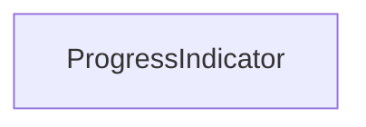

| public |
{:.api_label}

#### Inheritance Graph

## Description

Class for printing progress state to console

**Author**: Paul Justus, Benjamin Eikel

**Date**: 2010-06-08

## Public Functions

|
| ------: | ----------------- |
|  | |
|  | **[ProgressIndicator](#classUtil_1_1ProgressIndicator_1a6d15d384c69b973e9336725562296562)**(std::string description, uint32_t totalSteps, double updateInterval) |
|  | |
| void | **[increment](#classUtil_1_1ProgressIndicator_1a4597bda1520a4630c4f16873a606b92f)**() |
|  | |
| bool | **[operator==](#classUtil_1_1ProgressIndicator_1adcc3903ebb595a9eb0d349b4ee77bb08)**(const [ProgressIndicator](classUtil_1_1ProgressIndicator) & other) const |
{: .nohead .nowrap1 .api_section }

-------------------------------------------------------------------

## Documentation

### <small>function</small>  Util::ProgressIndicator::ProgressIndicator {#classUtil_1_1ProgressIndicator_1a6d15d384c69b973e9336725562296562}

| public |
{:.api_label}

|
| ------: | ----------------- |
|  |
|  **[ProgressIndicator](#classUtil_1_1ProgressIndicator_1a6d15d384c69b973e9336725562296562)**( | std::string | **description**, |
| | uint32_t | **totalSteps**, |
| | double | **updateInterval** |
|   ) |
{: .nohead .nowrap1 .api_doc }

Create a [ProgressIndicator](classUtil_1_1ProgressIndicator) .

#### Parameters
**description**
:  Description of the progress that is output together with the progress state

**totalSteps**
:  Total number of steps during the progress

**updateInterval**
:  Duration in seconds indicates between output of progress state

Defined in `Util/ProgressIndicator.h:40`{:style="float: right"}

-------------------------------------------------------------------

### <small>function</small>  Util::ProgressIndicator::increment {#classUtil_1_1ProgressIndicator_1a4597bda1520a4630c4f16873a606b92f}

| public |
{:.api_label}

|
| ------: | ----------------- |
|  |
| void **[increment](#classUtil_1_1ProgressIndicator_1a4597bda1520a4630c4f16873a606b92f)**( |  ) |
{: .nohead .nowrap1 .api_doc }

Increment the number of finished steps by one. Print the progress state if the elapsed time since the last update is larger than the defined interval.

Defined in `Util/ProgressIndicator.h:46`{:style="float: right"}

-------------------------------------------------------------------

### <small>function</small>  Util::ProgressIndicator::operator== {#classUtil_1_1ProgressIndicator_1adcc3903ebb595a9eb0d349b4ee77bb08}

| public | const | inline |
{:.api_label}

|
| ------: | ----------------- |
|  |
| bool **[operator==](#classUtil_1_1ProgressIndicator_1adcc3903ebb595a9eb0d349b4ee77bb08)**( | const [ProgressIndicator](classUtil_1_1ProgressIndicator) & | **other** ) const |
{: .nohead .nowrap1 .api_doc }

Defined in `Util/ProgressIndicator.h:48`{:style="float: right"}

-------------------------------------------------------------------

