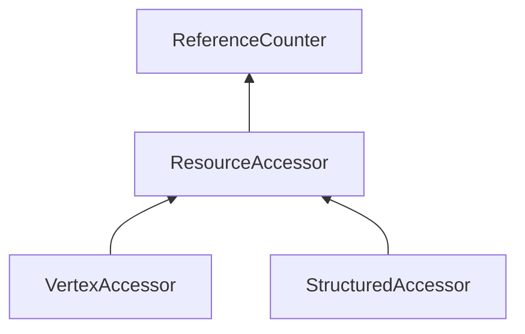

| public |
{:.api_label}

#### Inheritance Graph

## Description

 [ResourceAccessor](classUtil_1_1ResourceAccessor) 

## Protected Functions

|
| ------: | ----------------- |
|  | |
| void | **[assertRangeLocation](#classUtil_1_1ResourceAccessor_1a46f03cf395bf69fabd62ce51af8f7361)**(uint32_t index, uint16_t location) const |
|  | |
| void | **[assertAttribute](#classUtil_1_1ResourceAccessor_1acedcdfe85b81303e0d95cbddb3cddd11)**(const [StringIdentifier](classUtil_1_1StringIdentifier) & id) const |
{: .nohead .nowrap1 .api_section }

## Public Functions

|
| ------: | ----------------- |
|  | |
|  | **[ResourceAccessor](#classUtil_1_1ResourceAccessor_1ad544bbb6448adea99f9a663228454077)**(uint8_t * ptr, size_t size,  [ResourceFormat](classUtil_1_1ResourceFormat)  format) |
|  | |
|  | **[~ResourceAccessor](#classUtil_1_1ResourceAccessor_1a19f1869060e612408a11ecb8c8305dc7)**() |
|  | |
| void | **[readRaw](#classUtil_1_1ResourceAccessor_1a241a20f1864f9182ca0e94eb189192de)**(size_t index, uint8_t * targetPtr, size_t count) |
|  | |
| void | **[writeRaw](#classUtil_1_1ResourceAccessor_1a6003a083e46c16f975847a8b02b6dc8a)**(size_t index, const uint8_t * sourcePtr, size_t count) |
| template< typename T  >  | |
| void | **[readValues](#classUtil_1_1ResourceAccessor_1a494cae26c58d2b54e9cfdceb1cf311fe)**(size_t index, uint16_t location, T * values, size_t count) const |
| template< typename T  >  | |
| T | **[readValue](#classUtil_1_1ResourceAccessor_1a09e1651df1fd0b3671a0858817c78c6d)**(size_t index, uint16_t location) const |
| template< typename T  >  | |
| std::vector< T > | **[readValues](#classUtil_1_1ResourceAccessor_1ac02aa3cd41e5e46772a6c6c89c2cdecb)**(size_t index, uint16_t location, size_t count) const |
| template< typename T  >  | |
| void | **[readValues](#classUtil_1_1ResourceAccessor_1ae77f28a51008343e45238a168ce95510)**(size_t index, const [StringIdentifier](classUtil_1_1StringIdentifier) & id, T * values, size_t count) const |
| template< typename T  >  | |
| T | **[readValue](#classUtil_1_1ResourceAccessor_1a76b17ec2004fb305e925a248424224e0)**(size_t index, const [StringIdentifier](classUtil_1_1StringIdentifier) & id) const |
| template< typename T  >  | |
| std::vector< T > | **[readValues](#classUtil_1_1ResourceAccessor_1a12a61fba3e50de829cfe81dd2c92eda6)**(size_t index, const [StringIdentifier](classUtil_1_1StringIdentifier) & id, size_t count) const |
| template< typename T  >  | |
| void | **[writeValues](#classUtil_1_1ResourceAccessor_1aacb88b9a58553aa5d9370d9910e56a9c)**(size_t index, uint16_t location, const T * values, size_t count) |
| template< typename T  >  | |
| void | **[writeValues](#classUtil_1_1ResourceAccessor_1adee4e6fc11ec1a9941fab590b6163db7)**(size_t index, const [StringIdentifier](classUtil_1_1StringIdentifier) & id, const T * values, size_t count) |
| template< typename T  >  | |
| void | **[writeValue](#classUtil_1_1ResourceAccessor_1aba28b8335f888f65dfc22c2f0a95501d)**(size_t index, uint16_t location, const T & value) |
| template< typename T  >  | |
| void | **[writeValue](#classUtil_1_1ResourceAccessor_1a8ed93ef74a3100d0cb0c5c48b9fa7be6)**(size_t index, const [StringIdentifier](classUtil_1_1StringIdentifier) & id, const T & value) |
| template< typename T  >  | |
| void | **[writeValues](#classUtil_1_1ResourceAccessor_1a47b4040e12779d2bdcb3f1c47f3430b1)**(size_t index, uint16_t location, const std::vector< T > & values) |
| template< typename T  >  | |
| void | **[writeValues](#classUtil_1_1ResourceAccessor_1a8934e3fd54a12443f9fd3896086c6d53)**(size_t index, const [StringIdentifier](classUtil_1_1StringIdentifier) & id, const std::vector< T > & values) |
|  | |
| const [ResourceFormat](classUtil_1_1ResourceFormat) & | **[getFormat](#classUtil_1_1ResourceAccessor_1a26e6381f0caeb6af68159d4a97ec4ae5)**() const |
|  | |
| size_t | **[getDataSize](#classUtil_1_1ResourceAccessor_1aef0ed112cb2343809c8b529ae1bc250f)**() const |
|  | |
| size_t | **[getElementCount](#classUtil_1_1ResourceAccessor_1ae6a819d1128b71ef0399f7e06dfd23bf)**() const |
|  | |
| uint16_t | **[getAttributeLocation](#classUtil_1_1ResourceAccessor_1aa33bab374ba8e01b02eaf05ef7c2ad49)**(const [StringIdentifier](classUtil_1_1StringIdentifier) & id) const |
{: .nohead .nowrap1 .api_section }

-------------------------------------------------------------------

## Documentation

### <small>function</small>  Util::ResourceAccessor::assertRangeLocation {#classUtil_1_1ResourceAccessor_1a46f03cf395bf69fabd62ce51af8f7361}

| protected | const | inline |
{:.api_label}

|
| ------: | ----------------- |
|  |
| void **[assertRangeLocation](#classUtil_1_1ResourceAccessor_1a46f03cf395bf69fabd62ce51af8f7361)**( | uint32_t | **index**, |
| | uint16_t | **location** |
|   ) const |
{: .nohead .nowrap1 .api_doc }

Defined in `Util/Resources/ResourceAccessor.h:29`{:style="float: right"}

-------------------------------------------------------------------

### <small>function</small>  Util::ResourceAccessor::assertAttribute {#classUtil_1_1ResourceAccessor_1acedcdfe85b81303e0d95cbddb3cddd11}

| protected | const | inline |
{:.api_label}

|
| ------: | ----------------- |
|  |
| void **[assertAttribute](#classUtil_1_1ResourceAccessor_1acedcdfe85b81303e0d95cbddb3cddd11)**( | const [StringIdentifier](classUtil_1_1StringIdentifier) & | **id** ) const |
{: .nohead .nowrap1 .api_doc }

Defined in `Util/Resources/ResourceAccessor.h:30`{:style="float: right"}

-------------------------------------------------------------------

### <small>function</small>  Util::ResourceAccessor::ResourceAccessor {#classUtil_1_1ResourceAccessor_1ad544bbb6448adea99f9a663228454077}

| public |
{:.api_label}

|
| ------: | ----------------- |
|  |
|  **[ResourceAccessor](#classUtil_1_1ResourceAccessor_1ad544bbb6448adea99f9a663228454077)**( | uint8_t * | **ptr**, |
| | size_t | **size**, |
| |  [ResourceFormat](classUtil_1_1ResourceFormat)  | **format** |
|   ) |
{: .nohead .nowrap1 .api_doc }

Defined in `Util/Resources/ResourceAccessor.h:32`{:style="float: right"}

-------------------------------------------------------------------

### <small>function</small>  Util::ResourceAccessor::~ResourceAccessor {#classUtil_1_1ResourceAccessor_1a19f1869060e612408a11ecb8c8305dc7}

| public | virtual |
{:.api_label}

|
| ------: | ----------------- |
|  |
|  **[~ResourceAccessor](#classUtil_1_1ResourceAccessor_1a19f1869060e612408a11ecb8c8305dc7)**( |  ) |
{: .nohead .nowrap1 .api_doc }

Defined in `Util/Resources/ResourceAccessor.h:33`{:style="float: right"}

-------------------------------------------------------------------

### <small>function</small>  Util::ResourceAccessor::readRaw {#classUtil_1_1ResourceAccessor_1a241a20f1864f9182ca0e94eb189192de}

| public |
{:.api_label}

|
| ------: | ----------------- |
|  |
| void **[readRaw](#classUtil_1_1ResourceAccessor_1a241a20f1864f9182ca0e94eb189192de)**( | size_t | **index**, |
| | uint8_t * | **targetPtr**, |
| | size_t | **count** |
|   ) |
{: .nohead .nowrap1 .api_doc }

Reads one or more elements without any conversion Reads count many elements from the resource at the given index  targetPtr needs to be large enough to hold count many elements of the resources format size

Defined in `Util/Resources/ResourceAccessor.h:39`{:style="float: right"}

-------------------------------------------------------------------

### <small>function</small>  Util::ResourceAccessor::writeRaw {#classUtil_1_1ResourceAccessor_1a6003a083e46c16f975847a8b02b6dc8a}

| public |
{:.api_label}

|
| ------: | ----------------- |
|  |
| void **[writeRaw](#classUtil_1_1ResourceAccessor_1a6003a083e46c16f975847a8b02b6dc8a)**( | size_t | **index**, |
| | const uint8_t * | **sourcePtr**, |
| | size_t | **count** |
|   ) |
{: .nohead .nowrap1 .api_doc }

Writes one or more elements without any conversion Writes count many elements to the resource at the given index  ptr needs to be large enough to hold count many elements of the resources format size

Defined in `Util/Resources/ResourceAccessor.h:45`{:style="float: right"}

-------------------------------------------------------------------

### <small>function</small>  Util::ResourceAccessor::readValues {#classUtil_1_1ResourceAccessor_1a494cae26c58d2b54e9cfdceb1cf311fe}

| public | const | inline |
{:.api_label}

|
| ------: | ----------------- |
| template< typename T  > |
| void **[readValues](#classUtil_1_1ResourceAccessor_1a494cae26c58d2b54e9cfdceb1cf311fe)**( | size_t | **index**, |
| | uint16_t | **location**, |
| | T * | **values**, |
| | size_t | **count** |
|   ) const |
{: .nohead .nowrap1 .api_doc }

Defined in `Util/Resources/ResourceAccessor.h:48`{:style="float: right"}

-------------------------------------------------------------------

### <small>function</small>  Util::ResourceAccessor::readValue {#classUtil_1_1ResourceAccessor_1a09e1651df1fd0b3671a0858817c78c6d}

| public | const | inline |
{:.api_label}

|
| ------: | ----------------- |
| template< typename T  > |
| T **[readValue](#classUtil_1_1ResourceAccessor_1a09e1651df1fd0b3671a0858817c78c6d)**( | size_t | **index**, |
| | uint16_t | **location** |
|   ) const |
{: .nohead .nowrap1 .api_doc }

Defined in `Util/Resources/ResourceAccessor.h:54`{:style="float: right"}

-------------------------------------------------------------------

### <small>function</small>  Util::ResourceAccessor::readValues {#classUtil_1_1ResourceAccessor_1ac02aa3cd41e5e46772a6c6c89c2cdecb}

| public | const | inline |
{:.api_label}

|
| ------: | ----------------- |
| template< typename T  > |
| std::vector< T > **[readValues](#classUtil_1_1ResourceAccessor_1ac02aa3cd41e5e46772a6c6c89c2cdecb)**( | size_t | **index**, |
| | uint16_t | **location**, |
| | size_t | **count** |
|   ) const |
{: .nohead .nowrap1 .api_doc }

Defined in `Util/Resources/ResourceAccessor.h:61`{:style="float: right"}

-------------------------------------------------------------------

### <small>function</small>  Util::ResourceAccessor::readValues {#classUtil_1_1ResourceAccessor_1ae77f28a51008343e45238a168ce95510}

| public | const | inline |
{:.api_label}

|
| ------: | ----------------- |
| template< typename T  > |
| void **[readValues](#classUtil_1_1ResourceAccessor_1ae77f28a51008343e45238a168ce95510)**( | size_t | **index**, |
| | const [StringIdentifier](classUtil_1_1StringIdentifier) & | **id**, |
| | T * | **values**, |
| | size_t | **count** |
|   ) const |
{: .nohead .nowrap1 .api_doc }

Defined in `Util/Resources/ResourceAccessor.h:68`{:style="float: right"}

-------------------------------------------------------------------

### <small>function</small>  Util::ResourceAccessor::readValue {#classUtil_1_1ResourceAccessor_1a76b17ec2004fb305e925a248424224e0}

| public | const | inline |
{:.api_label}

|
| ------: | ----------------- |
| template< typename T  > |
| T **[readValue](#classUtil_1_1ResourceAccessor_1a76b17ec2004fb305e925a248424224e0)**( | size_t | **index**, |
| | const [StringIdentifier](classUtil_1_1StringIdentifier) & | **id** |
|   ) const |
{: .nohead .nowrap1 .api_doc }

Defined in `Util/Resources/ResourceAccessor.h:74`{:style="float: right"}

-------------------------------------------------------------------

### <small>function</small>  Util::ResourceAccessor::readValues {#classUtil_1_1ResourceAccessor_1a12a61fba3e50de829cfe81dd2c92eda6}

| public | const | inline |
{:.api_label}

|
| ------: | ----------------- |
| template< typename T  > |
| std::vector< T > **[readValues](#classUtil_1_1ResourceAccessor_1a12a61fba3e50de829cfe81dd2c92eda6)**( | size_t | **index**, |
| | const [StringIdentifier](classUtil_1_1StringIdentifier) & | **id**, |
| | size_t | **count** |
|   ) const |
{: .nohead .nowrap1 .api_doc }

Defined in `Util/Resources/ResourceAccessor.h:80`{:style="float: right"}

-------------------------------------------------------------------

### <small>function</small>  Util::ResourceAccessor::writeValues {#classUtil_1_1ResourceAccessor_1aacb88b9a58553aa5d9370d9910e56a9c}

| public | inline |
{:.api_label}

|
| ------: | ----------------- |
| template< typename T  > |
| void **[writeValues](#classUtil_1_1ResourceAccessor_1aacb88b9a58553aa5d9370d9910e56a9c)**( | size_t | **index**, |
| | uint16_t | **location**, |
| | const T * | **values**, |
| | size_t | **count** |
|   ) |
{: .nohead .nowrap1 .api_doc }

Defined in `Util/Resources/ResourceAccessor.h:86`{:style="float: right"}

-------------------------------------------------------------------

### <small>function</small>  Util::ResourceAccessor::writeValues {#classUtil_1_1ResourceAccessor_1adee4e6fc11ec1a9941fab590b6163db7}

| public | inline |
{:.api_label}

|
| ------: | ----------------- |
| template< typename T  > |
| void **[writeValues](#classUtil_1_1ResourceAccessor_1adee4e6fc11ec1a9941fab590b6163db7)**( | size_t | **index**, |
| | const [StringIdentifier](classUtil_1_1StringIdentifier) & | **id**, |
| | const T * | **values**, |
| | size_t | **count** |
|   ) |
{: .nohead .nowrap1 .api_doc }

Defined in `Util/Resources/ResourceAccessor.h:93`{:style="float: right"}

-------------------------------------------------------------------

### <small>function</small>  Util::ResourceAccessor::writeValue {#classUtil_1_1ResourceAccessor_1aba28b8335f888f65dfc22c2f0a95501d}

| public | inline |
{:.api_label}

|
| ------: | ----------------- |
| template< typename T  > |
| void **[writeValue](#classUtil_1_1ResourceAccessor_1aba28b8335f888f65dfc22c2f0a95501d)**( | size_t | **index**, |
| | uint16_t | **location**, |
| | const T & | **value** |
|   ) |
{: .nohead .nowrap1 .api_doc }

Defined in `Util/Resources/ResourceAccessor.h:98`{:style="float: right"}

-------------------------------------------------------------------

### <small>function</small>  Util::ResourceAccessor::writeValue {#classUtil_1_1ResourceAccessor_1a8ed93ef74a3100d0cb0c5c48b9fa7be6}

| public | inline |
{:.api_label}

|
| ------: | ----------------- |
| template< typename T  > |
| void **[writeValue](#classUtil_1_1ResourceAccessor_1a8ed93ef74a3100d0cb0c5c48b9fa7be6)**( | size_t | **index**, |
| | const [StringIdentifier](classUtil_1_1StringIdentifier) & | **id**, |
| | const T & | **value** |
|   ) |
{: .nohead .nowrap1 .api_doc }

Defined in `Util/Resources/ResourceAccessor.h:103`{:style="float: right"}

-------------------------------------------------------------------

### <small>function</small>  Util::ResourceAccessor::writeValues {#classUtil_1_1ResourceAccessor_1a47b4040e12779d2bdcb3f1c47f3430b1}

| public | inline |
{:.api_label}

|
| ------: | ----------------- |
| template< typename T  > |
| void **[writeValues](#classUtil_1_1ResourceAccessor_1a47b4040e12779d2bdcb3f1c47f3430b1)**( | size_t | **index**, |
| | uint16_t | **location**, |
| | const std::vector< T > & | **values** |
|   ) |
{: .nohead .nowrap1 .api_doc }

Defined in `Util/Resources/ResourceAccessor.h:108`{:style="float: right"}

-------------------------------------------------------------------

### <small>function</small>  Util::ResourceAccessor::writeValues {#classUtil_1_1ResourceAccessor_1a8934e3fd54a12443f9fd3896086c6d53}

| public | inline |
{:.api_label}

|
| ------: | ----------------- |
| template< typename T  > |
| void **[writeValues](#classUtil_1_1ResourceAccessor_1a8934e3fd54a12443f9fd3896086c6d53)**( | size_t | **index**, |
| | const [StringIdentifier](classUtil_1_1StringIdentifier) & | **id**, |
| | const std::vector< T > & | **values** |
|   ) |
{: .nohead .nowrap1 .api_doc }

Defined in `Util/Resources/ResourceAccessor.h:113`{:style="float: right"}

-------------------------------------------------------------------

### <small>function</small>  Util::ResourceAccessor::getFormat {#classUtil_1_1ResourceAccessor_1a26e6381f0caeb6af68159d4a97ec4ae5}

| public | const | inline |
{:.api_label}

|
| ------: | ----------------- |
|  |
| const [ResourceFormat](classUtil_1_1ResourceFormat) & **[getFormat](#classUtil_1_1ResourceAccessor_1a26e6381f0caeb6af68159d4a97ec4ae5)**( |  ) const |
{: .nohead .nowrap1 .api_doc }

Defined in `Util/Resources/ResourceAccessor.h:117`{:style="float: right"}

-------------------------------------------------------------------

### <small>function</small>  Util::ResourceAccessor::getDataSize {#classUtil_1_1ResourceAccessor_1aef0ed112cb2343809c8b529ae1bc250f}

| public | const | inline |
{:.api_label}

|
| ------: | ----------------- |
|  |
| size_t **[getDataSize](#classUtil_1_1ResourceAccessor_1aef0ed112cb2343809c8b529ae1bc250f)**( |  ) const |
{: .nohead .nowrap1 .api_doc }

Defined in `Util/Resources/ResourceAccessor.h:118`{:style="float: right"}

-------------------------------------------------------------------

### <small>function</small>  Util::ResourceAccessor::getElementCount {#classUtil_1_1ResourceAccessor_1ae6a819d1128b71ef0399f7e06dfd23bf}

| public | const | inline |
{:.api_label}

|
| ------: | ----------------- |
|  |
| size_t **[getElementCount](#classUtil_1_1ResourceAccessor_1ae6a819d1128b71ef0399f7e06dfd23bf)**( |  ) const |
{: .nohead .nowrap1 .api_doc }

Defined in `Util/Resources/ResourceAccessor.h:119`{:style="float: right"}

-------------------------------------------------------------------

### <small>function</small>  Util::ResourceAccessor::getAttributeLocation {#classUtil_1_1ResourceAccessor_1aa33bab374ba8e01b02eaf05ef7c2ad49}

| public | const | inline |
{:.api_label}

|
| ------: | ----------------- |
|  |
| uint16_t **[getAttributeLocation](#classUtil_1_1ResourceAccessor_1aa33bab374ba8e01b02eaf05ef7c2ad49)**( | const [StringIdentifier](classUtil_1_1StringIdentifier) & | **id** ) const |
{: .nohead .nowrap1 .api_doc }

Defined in `Util/Resources/ResourceAccessor.h:120`{:style="float: right"}

-------------------------------------------------------------------

