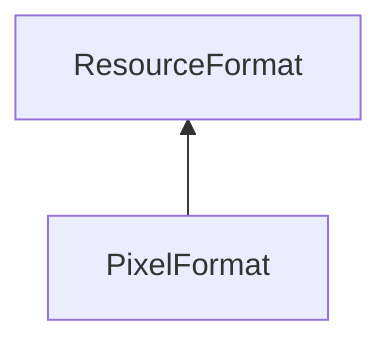

| public |
{:.api_label}

#### Inheritance Graph

## Description

 [ResourceFormat](classUtil_1_1ResourceFormat) 

## Public Types

|
| ------: | ----------------- |
|  | |
| typedef [ResourceAttribute](classUtil_1_1ResourceAttribute) | **[Attribute](#classUtil_1_1ResourceFormat_1a6420883062ceced01731fe5b078be93f)**  |
|  | |
| typedef std::deque< [Attribute](classUtil_1_1ResourceFormat#classUtil_1_1ResourceFormat_1a6420883062ceced01731fe5b078be93f) > | **[AttributeContainer_t](#classUtil_1_1ResourceFormat_1a18b0e745322fd972be045c949ba952eb)**  |
{: .nohead .nowrap1 .api_section }

## Public Static Attributes

|
| ------: | ----------------- |
|  | |
| const [ResourceFormat](classUtil_1_1ResourceFormat) | **[BYTE_FORMAT](#classUtil_1_1ResourceFormat_1a8e89f80d9e2c1d79edad86165608a444)**  |
{: .nohead .nowrap1 .api_section }

## Public Functions

|
| ------: | ----------------- |
|  | |
|  | **[ResourceFormat](#classUtil_1_1ResourceFormat_1a1a96d0b123b08220cfa9c634fef5f4aa)**(size_t _attributeAlignment) |
|  | |
|  | **[~ResourceFormat](#classUtil_1_1ResourceFormat_1ad210e59369ce9c9f1903522169f1b2f2)**() |
|  | |
| const [Attribute](classUtil_1_1ResourceFormat#classUtil_1_1ResourceFormat_1a6420883062ceced01731fe5b078be93f) & | **[appendAttribute](#classUtil_1_1ResourceFormat_1ac0f4e25b449b4be2342c7ae5df0999db)**(const [StringIdentifier](classUtil_1_1StringIdentifier) & nameId,  [TypeConstant](group%5F%5Futil%5F%5Fhelper#group%5F%5Futil%5F%5Fhelper_1ga1a435620d3040a5fff9aa70ec2be94a1)  type, uint8_t numValues, bool normalized) |
|  | |
| const [Attribute](classUtil_1_1ResourceFormat#classUtil_1_1ResourceFormat_1a6420883062ceced01731fe5b078be93f) & | **[appendFloat](#classUtil_1_1ResourceFormat_1ad88332e9e5c97d9dfba0b971e968158b)**(const [Util::StringIdentifier](classUtil_1_1StringIdentifier) & nameId, uint8_t numValues, bool normalized)   Add an attribute with the given name and the given number of float values. |
|  | |
| const [Attribute](classUtil_1_1ResourceFormat#classUtil_1_1ResourceFormat_1a6420883062ceced01731fe5b078be93f) & | **[appendUInt](#classUtil_1_1ResourceFormat_1a074d469769f2b225076d97d09631c41c)**(const [Util::StringIdentifier](classUtil_1_1StringIdentifier) & nameId, uint8_t numValues)   Add an attribute with the given name and the given number of unsigned int values. |
|  | |
| const [Attribute](classUtil_1_1ResourceFormat#classUtil_1_1ResourceFormat_1a6420883062ceced01731fe5b078be93f) & | **[appendInt](#classUtil_1_1ResourceFormat_1a2a9a21ca4c1239fd1bed13e0aa9456b7)**(const [Util::StringIdentifier](classUtil_1_1StringIdentifier) & nameId, uint8_t numValues)   Add an attribute with the given name and the given number of int values. |
|  | |
| const [Attribute](classUtil_1_1ResourceFormat#classUtil_1_1ResourceFormat_1a6420883062ceced01731fe5b078be93f) & | **[getAttribute](#classUtil_1_1ResourceFormat_1a0c8fb406314c0f6e8c93570e6157da6e)**(const [StringIdentifier](classUtil_1_1StringIdentifier) & nameId) const |
|  | |
| const [Attribute](classUtil_1_1ResourceFormat#classUtil_1_1ResourceFormat_1a6420883062ceced01731fe5b078be93f) & | **[getAttribute](#classUtil_1_1ResourceFormat_1a605b726096243999687e274a47609329)**(const std::string & name) const |
|  | |
| bool | **[hasAttribute](#classUtil_1_1ResourceFormat_1a98f47236bedc7160bf06c55fb8b3d808)**(const [StringIdentifier](classUtil_1_1StringIdentifier) & nameId) const |
|  | |
| bool | **[hasAttribute](#classUtil_1_1ResourceFormat_1a4f35f7087798a43cbc3b68619dbcb524)**(const std::string & name) const |
|  | |
| const uint16_t | **[getAttributeLocation](#classUtil_1_1ResourceFormat_1a4853cfa3da80e1f304b9093a07854044)**(const [StringIdentifier](classUtil_1_1StringIdentifier) & nameId) const |
|  | |
| const uint16_t | **[getAttributeLocation](#classUtil_1_1ResourceFormat_1a9dbfd7ef4e275aa5af6719b6fa0a5114)**(const std::string & name) const |
|  | |
| void | **[updateAttribute](#classUtil_1_1ResourceFormat_1a3095b190bb8fc8de0b52f7ddb8b7d61b)**(const [Attribute](classUtil_1_1ResourceFormat#classUtil_1_1ResourceFormat_1a6420883062ceced01731fe5b078be93f) & attr) |
|  | |
| size_t | **[getSize](#classUtil_1_1ResourceFormat_1aad98fbef6b04002337755db5a9fb362d)**() const |
|  | |
| size_t | **[getNumAttributes](#classUtil_1_1ResourceFormat_1a9d61252d5dbd73be056dd250c2c8d143)**() const |
|  | |
| const [AttributeContainer_t](classUtil_1_1ResourceFormat#classUtil_1_1ResourceFormat_1a18b0e745322fd972be045c949ba952eb) & | **[getAttributes](#classUtil_1_1ResourceFormat_1a62b2f6e1cf8ae7bca8919e5027cfb1ad)**() const |
|  | |
| bool | **[operator==](#classUtil_1_1ResourceFormat_1a1a6cbd22f178c750dfc72c25145d7bc2)**(const [ResourceFormat](classUtil_1_1ResourceFormat) & other) const |
|  | |
| bool | **[operator!=](#classUtil_1_1ResourceFormat_1a0ed1f3aa82624ce95af430b359ef6f90)**(const [ResourceFormat](classUtil_1_1ResourceFormat) & other) const |
|  | |
| bool | **[operator&lt;](#classUtil_1_1ResourceFormat_1a0b0051d18e9602f5dcfb45e96e7aced1)**(const [ResourceFormat](classUtil_1_1ResourceFormat) & other) const |
|  | |
| std::string | **[toString](#classUtil_1_1ResourceFormat_1a0b12c770baed03865f40dd266a619a9c)**() const |
{: .nohead .nowrap1 .api_section }

-------------------------------------------------------------------

## Documentation

### <small>typedef</small>  Util::ResourceFormat::Attribute {#classUtil_1_1ResourceFormat_1a6420883062ceced01731fe5b078be93f}

| public |
{:.api_label}

|
| ------: | ----------------- |
|  |
| typedef [ResourceAttribute](classUtil_1_1ResourceAttribute) **[Attribute](#classUtil_1_1ResourceFormat_1a6420883062ceced01731fe5b078be93f)**  |
{: .nohead .nowrap1 .api_doc }

Defined in `Util/Resources/ResourceFormat.h:65`{:style="float: right"}

-------------------------------------------------------------------

### <small>typedef</small>  Util::ResourceFormat::AttributeContainer_t {#classUtil_1_1ResourceFormat_1a18b0e745322fd972be045c949ba952eb}

| public |
{:.api_label}

|
| ------: | ----------------- |
|  |
| typedef std::deque< [Attribute](classUtil_1_1ResourceFormat#classUtil_1_1ResourceFormat_1a6420883062ceced01731fe5b078be93f) > **[AttributeContainer_t](#classUtil_1_1ResourceFormat_1a18b0e745322fd972be045c949ba952eb)**  |
{: .nohead .nowrap1 .api_doc }

Defined in `Util/Resources/ResourceFormat.h:66`{:style="float: right"}

-------------------------------------------------------------------

### <small>variable</small>  Util::ResourceFormat::BYTE_FORMAT {#classUtil_1_1ResourceFormat_1a8e89f80d9e2c1d79edad86165608a444}

| public | static |
{:.api_label}

|
| ------: | ----------------- |
|  |
| const [ResourceFormat](classUtil_1_1ResourceFormat) **[BYTE_FORMAT](#classUtil_1_1ResourceFormat_1a8e89f80d9e2c1d79edad86165608a444)**  |
{: .nohead .nowrap1 .api_doc }

Defined in `Util/Resources/ResourceFormat.h:68`{:style="float: right"}

-------------------------------------------------------------------

### <small>function</small>  Util::ResourceFormat::ResourceFormat {#classUtil_1_1ResourceFormat_1a1a96d0b123b08220cfa9c634fef5f4aa}

| public | inline |
{:.api_label}

|
| ------: | ----------------- |
|  |
|  **[ResourceFormat](#classUtil_1_1ResourceFormat_1a1a96d0b123b08220cfa9c634fef5f4aa)**( | size_t | **_attributeAlignment** ) |
{: .nohead .nowrap1 .api_doc }

Defined in `Util/Resources/ResourceFormat.h:70`{:style="float: right"}

-------------------------------------------------------------------

### <small>function</small>  Util::ResourceFormat::~ResourceFormat {#classUtil_1_1ResourceFormat_1ad210e59369ce9c9f1903522169f1b2f2}

| public | virtual |
{:.api_label}

|
| ------: | ----------------- |
|  |
|  **[~ResourceFormat](#classUtil_1_1ResourceFormat_1ad210e59369ce9c9f1903522169f1b2f2)**( |  ) |
{: .nohead .nowrap1 .api_doc }

Defined in `Util/Resources/ResourceFormat.h:71`{:style="float: right"}

-------------------------------------------------------------------

### <small>function</small>  Util::ResourceFormat::appendAttribute {#classUtil_1_1ResourceFormat_1ac0f4e25b449b4be2342c7ae5df0999db}

| public |
{:.api_label}

|
| ------: | ----------------- |
|  |
| const [Attribute](classUtil_1_1ResourceFormat#classUtil_1_1ResourceFormat_1a6420883062ceced01731fe5b078be93f) & **[appendAttribute](#classUtil_1_1ResourceFormat_1ac0f4e25b449b4be2342c7ae5df0999db)**( | const [StringIdentifier](classUtil_1_1StringIdentifier) & | **nameId**, |
| |  [TypeConstant](group%5F%5Futil%5F%5Fhelper#group%5F%5Futil%5F%5Fhelper_1ga1a435620d3040a5fff9aa70ec2be94a1)  | **type**, |
| | uint8_t | **numValues**, |
| | bool | **normalized** |
|   ) |
{: .nohead .nowrap1 .api_doc }

Create and add a new attribute to the [ResourceFormat](classUtil_1_1ResourceFormat) .
#### Returns
the new attribute

> **Note**: the owner of the attribute is the [ResourceFormat](classUtil_1_1ResourceFormat) 

> **Note**: Before using this function, check a default method can be used instead (e.g. append appendVec3)

Defined in `Util/Resources/ResourceFormat.h:78`{:style="float: right"}

-------------------------------------------------------------------

### <small>function</small>  Util::ResourceFormat::appendFloat {#classUtil_1_1ResourceFormat_1ad88332e9e5c97d9dfba0b971e968158b}

| public | inline |
{:.api_label}

|
| ------: | ----------------- |
|  |
| const [Attribute](classUtil_1_1ResourceFormat#classUtil_1_1ResourceFormat_1a6420883062ceced01731fe5b078be93f) & **[appendFloat](#classUtil_1_1ResourceFormat_1ad88332e9e5c97d9dfba0b971e968158b)**( | const [Util::StringIdentifier](classUtil_1_1StringIdentifier) & | **nameId**, |
| | uint8_t | **numValues**, |
| | bool | **normalized** |
|   ) |
{: .nohead .nowrap1 .api_doc }

Add an attribute with the given name and the given number of float values.

Defined in `Util/Resources/ResourceFormat.h:81`{:style="float: right"}

-------------------------------------------------------------------

### <small>function</small>  Util::ResourceFormat::appendUInt {#classUtil_1_1ResourceFormat_1a074d469769f2b225076d97d09631c41c}

| public | inline |
{:.api_label}

|
| ------: | ----------------- |
|  |
| const [Attribute](classUtil_1_1ResourceFormat#classUtil_1_1ResourceFormat_1a6420883062ceced01731fe5b078be93f) & **[appendUInt](#classUtil_1_1ResourceFormat_1a074d469769f2b225076d97d09631c41c)**( | const [Util::StringIdentifier](classUtil_1_1StringIdentifier) & | **nameId**, |
| | uint8_t | **numValues** |
|   ) |
{: .nohead .nowrap1 .api_doc }

Add an attribute with the given name and the given number of unsigned int values.

Defined in `Util/Resources/ResourceFormat.h:86`{:style="float: right"}

-------------------------------------------------------------------

### <small>function</small>  Util::ResourceFormat::appendInt {#classUtil_1_1ResourceFormat_1a2a9a21ca4c1239fd1bed13e0aa9456b7}

| public | inline |
{:.api_label}

|
| ------: | ----------------- |
|  |
| const [Attribute](classUtil_1_1ResourceFormat#classUtil_1_1ResourceFormat_1a6420883062ceced01731fe5b078be93f) & **[appendInt](#classUtil_1_1ResourceFormat_1a2a9a21ca4c1239fd1bed13e0aa9456b7)**( | const [Util::StringIdentifier](classUtil_1_1StringIdentifier) & | **nameId**, |
| | uint8_t | **numValues** |
|   ) |
{: .nohead .nowrap1 .api_doc }

Add an attribute with the given name and the given number of int values.

Defined in `Util/Resources/ResourceFormat.h:91`{:style="float: right"}

-------------------------------------------------------------------

### <small>function</small>  Util::ResourceFormat::getAttribute {#classUtil_1_1ResourceFormat_1a0c8fb406314c0f6e8c93570e6157da6e}

| public | const |
{:.api_label}

|
| ------: | ----------------- |
|  |
| const [Attribute](classUtil_1_1ResourceFormat#classUtil_1_1ResourceFormat_1a6420883062ceced01731fe5b078be93f) & **[getAttribute](#classUtil_1_1ResourceFormat_1a0c8fb406314c0f6e8c93570e6157da6e)**( | const [StringIdentifier](classUtil_1_1StringIdentifier) & | **nameId** ) const |
{: .nohead .nowrap1 .api_doc }

Get a reference to the attribute with the corresponding name.
#### Returns
Always returns an attribute. If the attribute is not present in the vertex description, it is empty.

> **Note**: The owner of the attribute is the [ResourceFormat](classUtil_1_1ResourceFormat) , so be careful if the [ResourceFormat](classUtil_1_1ResourceFormat) is deleted or reassigned.

Defined in `Util/Resources/ResourceFormat.h:100`{:style="float: right"}

-------------------------------------------------------------------

### <small>function</small>  Util::ResourceFormat::getAttribute {#classUtil_1_1ResourceFormat_1a605b726096243999687e274a47609329}

| public | const | inline |
{:.api_label}

|
| ------: | ----------------- |
|  |
| const [Attribute](classUtil_1_1ResourceFormat#classUtil_1_1ResourceFormat_1a6420883062ceced01731fe5b078be93f) & **[getAttribute](#classUtil_1_1ResourceFormat_1a605b726096243999687e274a47609329)**( | const std::string & | **name** ) const |
{: .nohead .nowrap1 .api_doc }

Defined in `Util/Resources/ResourceFormat.h:101`{:style="float: right"}

-------------------------------------------------------------------

### <small>function</small>  Util::ResourceFormat::hasAttribute {#classUtil_1_1ResourceFormat_1a98f47236bedc7160bf06c55fb8b3d808}

| public | const |
{:.api_label}

|
| ------: | ----------------- |
|  |
| bool **[hasAttribute](#classUtil_1_1ResourceFormat_1a98f47236bedc7160bf06c55fb8b3d808)**( | const [StringIdentifier](classUtil_1_1StringIdentifier) & | **nameId** ) const |
{: .nohead .nowrap1 .api_doc }

Defined in `Util/Resources/ResourceFormat.h:105`{:style="float: right"}

-------------------------------------------------------------------

### <small>function</small>  Util::ResourceFormat::hasAttribute {#classUtil_1_1ResourceFormat_1a4f35f7087798a43cbc3b68619dbcb524}

| public | const | inline |
{:.api_label}

|
| ------: | ----------------- |
|  |
| bool **[hasAttribute](#classUtil_1_1ResourceFormat_1a4f35f7087798a43cbc3b68619dbcb524)**( | const std::string & | **name** ) const |
{: .nohead .nowrap1 .api_doc }

Defined in `Util/Resources/ResourceFormat.h:106`{:style="float: right"}

-------------------------------------------------------------------

### <small>function</small>  Util::ResourceFormat::getAttributeLocation {#classUtil_1_1ResourceFormat_1a4853cfa3da80e1f304b9093a07854044}

| public | const |
{:.api_label}

|
| ------: | ----------------- |
|  |
| const uint16_t **[getAttributeLocation](#classUtil_1_1ResourceFormat_1a4853cfa3da80e1f304b9093a07854044)**( | const [StringIdentifier](classUtil_1_1StringIdentifier) & | **nameId** ) const |
{: .nohead .nowrap1 .api_doc }

Defined in `Util/Resources/ResourceFormat.h:110`{:style="float: right"}

-------------------------------------------------------------------

### <small>function</small>  Util::ResourceFormat::getAttributeLocation {#classUtil_1_1ResourceFormat_1a9dbfd7ef4e275aa5af6719b6fa0a5114}

| public | const | inline |
{:.api_label}

|
| ------: | ----------------- |
|  |
| const uint16_t **[getAttributeLocation](#classUtil_1_1ResourceFormat_1a9dbfd7ef4e275aa5af6719b6fa0a5114)**( | const std::string & | **name** ) const |
{: .nohead .nowrap1 .api_doc }

Defined in `Util/Resources/ResourceFormat.h:111`{:style="float: right"}

-------------------------------------------------------------------

### <small>function</small>  Util::ResourceFormat::updateAttribute {#classUtil_1_1ResourceFormat_1a3095b190bb8fc8de0b52f7ddb8b7d61b}

| public |
{:.api_label}

|
| ------: | ----------------- |
|  |
| void **[updateAttribute](#classUtil_1_1ResourceFormat_1a3095b190bb8fc8de0b52f7ddb8b7d61b)**( | const [Attribute](classUtil_1_1ResourceFormat#classUtil_1_1ResourceFormat_1a6420883062ceced01731fe5b078be93f) & | **attr** ) |
{: .nohead .nowrap1 .api_doc }

Update an existing attribute of or append a new attribute to the [ResourceFormat](classUtil_1_1ResourceFormat) .

#### Parameters
**attr**
:  Attribute that contains the new data.

> **Note**: The offsets of all attributes may be recalculated and therefore old values may become invalid.

Defined in `Util/Resources/ResourceFormat.h:121`{:style="float: right"}

-------------------------------------------------------------------

### <small>function</small>  Util::ResourceFormat::getSize {#classUtil_1_1ResourceFormat_1aad98fbef6b04002337755db5a9fb362d}

| public | const | inline |
{:.api_label}

|
| ------: | ----------------- |
|  |
| size_t **[getSize](#classUtil_1_1ResourceFormat_1aad98fbef6b04002337755db5a9fb362d)**( |  ) const |
{: .nohead .nowrap1 .api_doc }

Defined in `Util/Resources/ResourceFormat.h:123`{:style="float: right"}

-------------------------------------------------------------------

### <small>function</small>  Util::ResourceFormat::getNumAttributes {#classUtil_1_1ResourceFormat_1a9d61252d5dbd73be056dd250c2c8d143}

| public | const | inline |
{:.api_label}

|
| ------: | ----------------- |
|  |
| size_t **[getNumAttributes](#classUtil_1_1ResourceFormat_1a9d61252d5dbd73be056dd250c2c8d143)**( |  ) const |
{: .nohead .nowrap1 .api_doc }

Defined in `Util/Resources/ResourceFormat.h:124`{:style="float: right"}

-------------------------------------------------------------------

### <small>function</small>  Util::ResourceFormat::getAttributes {#classUtil_1_1ResourceFormat_1a62b2f6e1cf8ae7bca8919e5027cfb1ad}

| public | const | inline |
{:.api_label}

|
| ------: | ----------------- |
|  |
| const [AttributeContainer_t](classUtil_1_1ResourceFormat#classUtil_1_1ResourceFormat_1a18b0e745322fd972be045c949ba952eb) & **[getAttributes](#classUtil_1_1ResourceFormat_1a62b2f6e1cf8ae7bca8919e5027cfb1ad)**( |  ) const |
{: .nohead .nowrap1 .api_doc }

Defined in `Util/Resources/ResourceFormat.h:125`{:style="float: right"}

-------------------------------------------------------------------

### <small>function</small>  Util::ResourceFormat::operator== {#classUtil_1_1ResourceFormat_1a1a6cbd22f178c750dfc72c25145d7bc2}

| public | const |
{:.api_label}

|
| ------: | ----------------- |
|  |
| bool **[operator==](#classUtil_1_1ResourceFormat_1a1a6cbd22f178c750dfc72c25145d7bc2)**( | const [ResourceFormat](classUtil_1_1ResourceFormat) & | **other** ) const |
{: .nohead .nowrap1 .api_doc }

Defined in `Util/Resources/ResourceFormat.h:126`{:style="float: right"}

-------------------------------------------------------------------

### <small>function</small>  Util::ResourceFormat::operator!= {#classUtil_1_1ResourceFormat_1a0ed1f3aa82624ce95af430b359ef6f90}

| public | const |
{:.api_label}

|
| ------: | ----------------- |
|  |
| bool **[operator!=](#classUtil_1_1ResourceFormat_1a0ed1f3aa82624ce95af430b359ef6f90)**( | const [ResourceFormat](classUtil_1_1ResourceFormat) & | **other** ) const |
{: .nohead .nowrap1 .api_doc }

Defined in `Util/Resources/ResourceFormat.h:127`{:style="float: right"}

-------------------------------------------------------------------

### <small>function</small>  Util::ResourceFormat::operator&lt; {#classUtil_1_1ResourceFormat_1a0b0051d18e9602f5dcfb45e96e7aced1}

| public | const |
{:.api_label}

|
| ------: | ----------------- |
|  |
| bool **[operator&lt;](#classUtil_1_1ResourceFormat_1a0b0051d18e9602f5dcfb45e96e7aced1)**( | const [ResourceFormat](classUtil_1_1ResourceFormat) & | **other** ) const |
{: .nohead .nowrap1 .api_doc }

Defined in `Util/Resources/ResourceFormat.h:128`{:style="float: right"}

-------------------------------------------------------------------

### <small>function</small>  Util::ResourceFormat::toString {#classUtil_1_1ResourceFormat_1a0b12c770baed03865f40dd266a619a9c}

| public | const |
{:.api_label}

|
| ------: | ----------------- |
|  |
| std::string **[toString](#classUtil_1_1ResourceFormat_1a0b12c770baed03865f40dd266a619a9c)**( |  ) const |
{: .nohead .nowrap1 .api_doc }

Defined in `Util/Resources/ResourceFormat.h:130`{:style="float: right"}

-------------------------------------------------------------------

