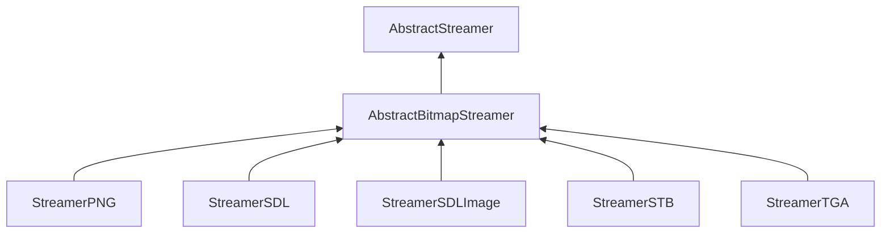

| public | abstract |
{:.api_label}

#### Inheritance Graph

## Description

Interface for classes that are capable of converting between bitmaps and streams.

**Author**: Benjamin Eikel

**Date**: 2011-09-08

## Public Functions

|
| ------: | ----------------- |
|  | |
|  | **[~AbstractBitmapStreamer](#classUtil_1_1Serialization_1_1AbstractBitmapStreamer_1a1f2311dd39f2f992522037f5f773b6d3)**() |
|  | |
| [Reference](classUtil_1_1Reference) < [Bitmap](classUtil_1_1Bitmap) > | **[loadBitmap](#classUtil_1_1Serialization_1_1AbstractBitmapStreamer_1aac585c02e09ca0e7a1801bf75fe7e993)**(std::istream & void) |
|  | |
| bool | **[saveBitmap](#classUtil_1_1Serialization_1_1AbstractBitmapStreamer_1af75f55e87d84c1c9299bc65f799a6ba7)**(const [Bitmap](classUtil_1_1Bitmap) & void, std::ostream & void) |
{: .nohead .nowrap1 .api_section }

## Protected Functions

|
| ------: | ----------------- |
|  | |
|  | **[AbstractBitmapStreamer](#classUtil_1_1Serialization_1_1AbstractBitmapStreamer_1a63907e0c28e93bda0359543b26e04b4a)**()   Creation is only possible in subclasses. |
{: .nohead .nowrap1 .api_section }

-------------------------------------------------------------------

## Documentation

### <small>function</small>  Util::Serialization::AbstractBitmapStreamer::~AbstractBitmapStreamer {#classUtil_1_1Serialization_1_1AbstractBitmapStreamer_1a1f2311dd39f2f992522037f5f773b6d3}

| public | inline | virtual |
{:.api_label}

|
| ------: | ----------------- |
|  |
|  **[~AbstractBitmapStreamer](#classUtil_1_1Serialization_1_1AbstractBitmapStreamer_1a1f2311dd39f2f992522037f5f773b6d3)**( |  ) |
{: .nohead .nowrap1 .api_doc }

Defined in `Util/Serialization/AbstractBitmapStreamer.h:34`{:style="float: right"}

-------------------------------------------------------------------

### <small>function</small>  Util::Serialization::AbstractBitmapStreamer::loadBitmap {#classUtil_1_1Serialization_1_1AbstractBitmapStreamer_1aac585c02e09ca0e7a1801bf75fe7e993}

| public | virtual |
{:.api_label}

|
| ------: | ----------------- |
|  |
| [Reference](classUtil_1_1Reference) < [Bitmap](classUtil_1_1Bitmap) > **[loadBitmap](#classUtil_1_1Serialization_1_1AbstractBitmapStreamer_1aac585c02e09ca0e7a1801bf75fe7e993)**( | std::istream & | **void** ) |
{: .nohead .nowrap1 .api_doc }

Load a bitmap from the given stream.

#### Parameters
**input**
:  Use the data from the stream beginning at the preset position.

#### Returns
 [Bitmap](classUtil_1_1Bitmap) object. The caller is responsible for the memory deallocation.

Defined in `Util/Serialization/AbstractBitmapStreamer.h:43`{:style="float: right"}

-------------------------------------------------------------------

### <small>function</small>  Util::Serialization::AbstractBitmapStreamer::saveBitmap {#classUtil_1_1Serialization_1_1AbstractBitmapStreamer_1af75f55e87d84c1c9299bc65f799a6ba7}

| public | inline | virtual |
{:.api_label}

|
| ------: | ----------------- |
|  |
| bool **[saveBitmap](#classUtil_1_1Serialization_1_1AbstractBitmapStreamer_1af75f55e87d84c1c9299bc65f799a6ba7)**( | const [Bitmap](classUtil_1_1Bitmap) & | **void**, |
| | std::ostream & | **void** |
|   ) |
{: .nohead .nowrap1 .api_doc }

Save a bitmap to the given stream.

#### Parameters
**bitmap**
:   [Bitmap](classUtil_1_1Bitmap) object to save.

**output**
:  Use the stream for writing beginning at the preset position.

#### Returns
`true`if successful,`false`otherwise.

Defined in `Util/Serialization/AbstractBitmapStreamer.h:52`{:style="float: right"}

-------------------------------------------------------------------

### <small>function</small>  Util::Serialization::AbstractBitmapStreamer::AbstractBitmapStreamer {#classUtil_1_1Serialization_1_1AbstractBitmapStreamer_1a63907e0c28e93bda0359543b26e04b4a}

| protected | inline |
{:.api_label}

|
| ------: | ----------------- |
|  |
|  **[AbstractBitmapStreamer](#classUtil_1_1Serialization_1_1AbstractBitmapStreamer_1a63907e0c28e93bda0359543b26e04b4a)**( |  ) |
{: .nohead .nowrap1 .api_doc }

Creation is only possible in subclasses.

Defined in `Util/Serialization/AbstractBitmapStreamer.h:59`{:style="float: right"}

-------------------------------------------------------------------

