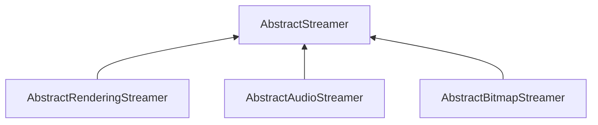

| public |
{:.api_label}

#### Inheritance Graph

## Description

Interface for classes that are capable of converting between objects and streams. Subclasses are allowed to implement only a subset of the functions. Capabilities can be queried.

**Author**: Benjamin Eikel

**Date**: 2011-02-03

## Public Static Attributes

|
| ------: | ----------------- |
|  | |
| const uint8_t | **[CAP_LOAD_GENERIC](#classUtil_1_1Serialization_1_1AbstractStreamer_1a131acd71796ab7a36e2041f09fae7890)**    Streamer supports the function*loadGeneric*. |
|  | |
| const uint8_t | **[CAP_SAVE_GENERIC](#classUtil_1_1Serialization_1_1AbstractStreamer_1acd8bcb9e7689af132f0d3d51650dcea3)**    Streamer supports the function*saveGeneric*. |
{: .nohead .nowrap1 .api_section }

## Public Functions

|
| ------: | ----------------- |
|  | |
|  | **[~AbstractStreamer](#classUtil_1_1Serialization_1_1AbstractStreamer_1a176516543ba3ca784210965d676389f8)**() |
|  | |
| [GenericAttributeList](classUtil_1_1GenericAttributeList) * | **[loadGeneric](#classUtil_1_1Serialization_1_1AbstractStreamer_1af8b0830d4ea545420d1b6faaf9fdcad3)**(std::istream & void) |
|  | |
| bool | **[saveGeneric](#classUtil_1_1Serialization_1_1AbstractStreamer_1a7ca6d506a2ab78f4ffd964b07d0a8373)**( [GenericAttributeList](classUtil_1_1GenericAttributeList) * void, std::ostream & void) |
{: .nohead .nowrap1 .api_section }

## Public Static Functions

|
| ------: | ----------------- |
|  | |
| uint8_t | **[queryCapabilities](#classUtil_1_1Serialization_1_1AbstractStreamer_1acc534d8bebc70ad9db59b5a4f82d3567)**(const std::string & void) |
{: .nohead .nowrap1 .api_section }

## Protected Functions

|
| ------: | ----------------- |
|  | |
|  | **[AbstractStreamer](#classUtil_1_1Serialization_1_1AbstractStreamer_1a1c4a75c7e1566771bef973eb11ff7e8b)**()   Creation is only possible in subclasses. |
{: .nohead .nowrap1 .api_section }

-------------------------------------------------------------------

## Documentation

### <small>variable</small>  Util::Serialization::AbstractStreamer::CAP_LOAD_GENERIC {#classUtil_1_1Serialization_1_1AbstractStreamer_1a131acd71796ab7a36e2041f09fae7890}

| public | static |
{:.api_label}

|
| ------: | ----------------- |
|  |
| const uint8_t **[CAP_LOAD_GENERIC](#classUtil_1_1Serialization_1_1AbstractStreamer_1a131acd71796ab7a36e2041f09fae7890)**  |
{: .nohead .nowrap1 .api_doc }

Streamer supports the function*loadGeneric*.

Defined in `Util/Serialization/AbstractStreamer.h:59`{:style="float: right"}

-------------------------------------------------------------------

### <small>variable</small>  Util::Serialization::AbstractStreamer::CAP_SAVE_GENERIC {#classUtil_1_1Serialization_1_1AbstractStreamer_1acd8bcb9e7689af132f0d3d51650dcea3}

| public | static |
{:.api_label}

|
| ------: | ----------------- |
|  |
| const uint8_t **[CAP_SAVE_GENERIC](#classUtil_1_1Serialization_1_1AbstractStreamer_1acd8bcb9e7689af132f0d3d51650dcea3)**  |
{: .nohead .nowrap1 .api_doc }

Streamer supports the function*saveGeneric*.

Defined in `Util/Serialization/AbstractStreamer.h:60`{:style="float: right"}

-------------------------------------------------------------------

### <small>function</small>  Util::Serialization::AbstractStreamer::~AbstractStreamer {#classUtil_1_1Serialization_1_1AbstractStreamer_1a176516543ba3ca784210965d676389f8}

| public | inline | virtual |
{:.api_label}

|
| ------: | ----------------- |
|  |
|  **[~AbstractStreamer](#classUtil_1_1Serialization_1_1AbstractStreamer_1a176516543ba3ca784210965d676389f8)**( |  ) |
{: .nohead .nowrap1 .api_doc }

Defined in `Util/Serialization/AbstractStreamer.h:33`{:style="float: right"}

-------------------------------------------------------------------

### <small>function</small>  Util::Serialization::AbstractStreamer::loadGeneric {#classUtil_1_1Serialization_1_1AbstractStreamer_1af8b0830d4ea545420d1b6faaf9fdcad3}

| public | inline | virtual |
{:.api_label}

|
| ------: | ----------------- |
|  |
| [GenericAttributeList](classUtil_1_1GenericAttributeList) * **[loadGeneric](#classUtil_1_1Serialization_1_1AbstractStreamer_1af8b0830d4ea545420d1b6faaf9fdcad3)**( | std::istream & | **void** ) |
{: .nohead .nowrap1 .api_doc }

Load generic data from the given stream.

#### Parameters
**input**
:  Use the data from the stream beginning at the preset position.

#### Returns
Description list containing the generic data. The caller is responsible for the memory deallocation.

Defined in `Util/Serialization/AbstractStreamer.h:42`{:style="float: right"}

-------------------------------------------------------------------

### <small>function</small>  Util::Serialization::AbstractStreamer::saveGeneric {#classUtil_1_1Serialization_1_1AbstractStreamer_1a7ca6d506a2ab78f4ffd964b07d0a8373}

| public | inline | virtual |
{:.api_label}

|
| ------: | ----------------- |
|  |
| bool **[saveGeneric](#classUtil_1_1Serialization_1_1AbstractStreamer_1a7ca6d506a2ab78f4ffd964b07d0a8373)**( |  [GenericAttributeList](classUtil_1_1GenericAttributeList) * | **void**, |
| | std::ostream & | **void** |
|   ) |
{: .nohead .nowrap1 .api_doc }

Save generic data to the given stream.

#### Parameters
**data**
:  Description list containing the generic data to save.

**output**
:  Use the stream for writing beginning at the preset position.

#### Returns
`true`if successful,`false`otherwise

Defined in `Util/Serialization/AbstractStreamer.h:54`{:style="float: right"}

-------------------------------------------------------------------

### <small>function</small>  Util::Serialization::AbstractStreamer::queryCapabilities {#classUtil_1_1Serialization_1_1AbstractStreamer_1acc534d8bebc70ad9db59b5a4f82d3567}

| public | static | inline |
{:.api_label}

|
| ------: | ----------------- |
|  |
| uint8_t **[queryCapabilities](#classUtil_1_1Serialization_1_1AbstractStreamer_1acc534d8bebc70ad9db59b5a4f82d3567)**( | const std::string & | **void** ) |
{: .nohead .nowrap1 .api_doc }

Check which capabilities are supported for the given file extension.

#### Parameters
**extension**
:  File extension in lower case to check capabilities for.

#### Returns
Bitmask consisting of a combination of*CAP_LOAD_GENERIC*,*CAP_SAVE_GENERIC*, flags that are defined by subclasses, or zero.

Defined in `Util/Serialization/AbstractStreamer.h:68`{:style="float: right"}

-------------------------------------------------------------------

### <small>function</small>  Util::Serialization::AbstractStreamer::AbstractStreamer {#classUtil_1_1Serialization_1_1AbstractStreamer_1a1c4a75c7e1566771bef973eb11ff7e8b}

| protected | inline |
{:.api_label}

|
| ------: | ----------------- |
|  |
|  **[AbstractStreamer](#classUtil_1_1Serialization_1_1AbstractStreamer_1a1c4a75c7e1566771bef973eb11ff7e8b)**( |  ) |
{: .nohead .nowrap1 .api_doc }

Creation is only possible in subclasses.

Defined in `Util/Serialization/AbstractStreamer.h:74`{:style="float: right"}

-------------------------------------------------------------------

