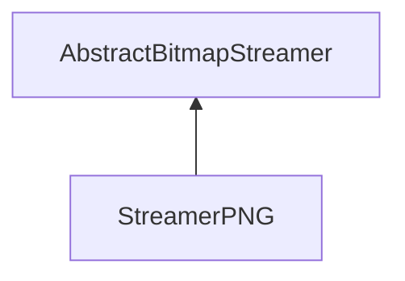

| public |
{:.api_label}

#### Inheritance Graph

## Description

## Public Functions

|
| ------: | ----------------- |
|  | |
|  | **[StreamerPNG](#classUtil_1_1Serialization_1_1StreamerPNG_1aceb5356cb2a6e7a24fcd9773b0c02bd1)**() |
|  | |
|  | **[~StreamerPNG](#classUtil_1_1Serialization_1_1StreamerPNG_1ae26ced41869d3d542e6485f9045ff3be)**() |
|  | |
| [Reference](classUtil_1_1Reference) < [Bitmap](classUtil_1_1Bitmap) > | **[loadBitmap](#classUtil_1_1Serialization_1_1StreamerPNG_1a08a5d3cae74c761e5e65f869f19f6f1d)**(std::istream & void) |
|  | |
| bool | **[saveBitmap](#classUtil_1_1Serialization_1_1StreamerPNG_1acb0a5c053cf4e461197793bdced759bc)**(const [Bitmap](classUtil_1_1Bitmap) & void, std::ostream & void) |
{: .nohead .nowrap1 .api_section }

## Public Static Functions

|
| ------: | ----------------- |
|  | |
| bool | **[init](#classUtil_1_1Serialization_1_1StreamerPNG_1afcb1854aaecee1a108191a58b9e31ea1)**() |
{: .nohead .nowrap1 .api_section }

-------------------------------------------------------------------

## Documentation

### <small>function</small>  Util::Serialization::StreamerPNG::StreamerPNG {#classUtil_1_1Serialization_1_1StreamerPNG_1aceb5356cb2a6e7a24fcd9773b0c02bd1}

| public | inline |
{:.api_label}

|
| ------: | ----------------- |
|  |
|  **[StreamerPNG](#classUtil_1_1Serialization_1_1StreamerPNG_1aceb5356cb2a6e7a24fcd9773b0c02bd1)**( |  ) |
{: .nohead .nowrap1 .api_doc }

Defined in `Util/Serialization/StreamerPNG.h:26`{:style="float: right"}

-------------------------------------------------------------------

### <small>function</small>  Util::Serialization::StreamerPNG::~StreamerPNG {#classUtil_1_1Serialization_1_1StreamerPNG_1ae26ced41869d3d542e6485f9045ff3be}

| public | inline | virtual |
{:.api_label}

|
| ------: | ----------------- |
|  |
|  **[~StreamerPNG](#classUtil_1_1Serialization_1_1StreamerPNG_1ae26ced41869d3d542e6485f9045ff3be)**( |  ) |
{: .nohead .nowrap1 .api_doc }

Defined in `Util/Serialization/StreamerPNG.h:29`{:style="float: right"}

-------------------------------------------------------------------

### <small>function</small>  Util::Serialization::StreamerPNG::loadBitmap {#classUtil_1_1Serialization_1_1StreamerPNG_1a08a5d3cae74c761e5e65f869f19f6f1d}

| public | virtual |
{:.api_label}

|
| ------: | ----------------- |
|  |
| [Reference](classUtil_1_1Reference) < [Bitmap](classUtil_1_1Bitmap) > **[loadBitmap](#classUtil_1_1Serialization_1_1StreamerPNG_1a08a5d3cae74c761e5e65f869f19f6f1d)**( | std::istream & | **void** ) |
{: .nohead .nowrap1 .api_doc }

Load a bitmap from the given stream.

#### Parameters
**input**
:  Use the data from the stream beginning at the preset position.

#### Returns
 [Bitmap](classUtil_1_1Bitmap) object. The caller is responsible for the memory deallocation.

Defined in `Util/Serialization/StreamerPNG.h:32`{:style="float: right"}

-------------------------------------------------------------------

### <small>function</small>  Util::Serialization::StreamerPNG::saveBitmap {#classUtil_1_1Serialization_1_1StreamerPNG_1acb0a5c053cf4e461197793bdced759bc}

| public | virtual |
{:.api_label}

|
| ------: | ----------------- |
|  |
| bool **[saveBitmap](#classUtil_1_1Serialization_1_1StreamerPNG_1acb0a5c053cf4e461197793bdced759bc)**( | const [Bitmap](classUtil_1_1Bitmap) & | **void**, |
| | std::ostream & | **void** |
|   ) |
{: .nohead .nowrap1 .api_doc }

Save a bitmap to the given stream.

#### Parameters
**bitmap**
:   [Bitmap](classUtil_1_1Bitmap) object to save.

**output**
:  Use the stream for writing beginning at the preset position.

#### Returns
`true`if successful,`false`otherwise.

Defined in `Util/Serialization/StreamerPNG.h:33`{:style="float: right"}

-------------------------------------------------------------------

### <small>function</small>  Util::Serialization::StreamerPNG::init {#classUtil_1_1Serialization_1_1StreamerPNG_1afcb1854aaecee1a108191a58b9e31ea1}

| public | static |
{:.api_label}

|
| ------: | ----------------- |
|  |
| bool **[init](#classUtil_1_1Serialization_1_1StreamerPNG_1afcb1854aaecee1a108191a58b9e31ea1)**( |  ) |
{: .nohead .nowrap1 .api_doc }

Defined in `Util/Serialization/StreamerPNG.h:35`{:style="float: right"}

-------------------------------------------------------------------

