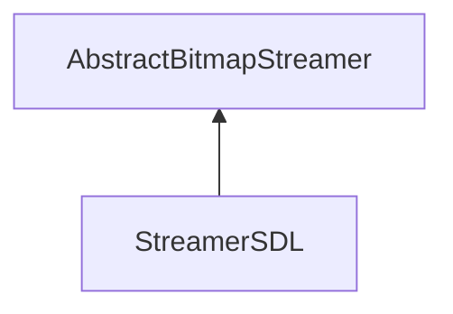

| public |
{:.api_label}

#### Inheritance Graph

## Description

Very inefficient streamer that relies on saving temporary files. This streamer should be deleted and replaced by an own implementation for reading/writing BMP images.

**Author**: Benjamin Eikel

**Date**: 2011-09-08

## Public Functions

|
| ------: | ----------------- |
|  | |
|  | **[StreamerSDL](#classUtil_1_1Serialization_1_1StreamerSDL_1a5469d5dfd7a876f22f6f78673a5ee33b)**() |
|  | |
|  | **[~StreamerSDL](#classUtil_1_1Serialization_1_1StreamerSDL_1a1a081694234688a50a5cfec35c7cf2f5)**() |
|  | |
| [Reference](classUtil_1_1Reference) < [Bitmap](classUtil_1_1Bitmap) > | **[loadBitmap](#classUtil_1_1Serialization_1_1StreamerSDL_1a1515dcfdd2a154f4341e3c90673e9e5f)**(std::istream & void) |
|  | |
| bool | **[saveBitmap](#classUtil_1_1Serialization_1_1StreamerSDL_1ad41758fadf119dd62934bd7b0f265111)**(const [Bitmap](classUtil_1_1Bitmap) & void, std::ostream & void) |
{: .nohead .nowrap1 .api_section }

## Public Static Functions

|
| ------: | ----------------- |
|  | |
| bool | **[init](#classUtil_1_1Serialization_1_1StreamerSDL_1a249eb5044a8d9844a4ea8bab8a29c24b)**() |
{: .nohead .nowrap1 .api_section }

-------------------------------------------------------------------

## Documentation

### <small>function</small>  Util::Serialization::StreamerSDL::StreamerSDL {#classUtil_1_1Serialization_1_1StreamerSDL_1a5469d5dfd7a876f22f6f78673a5ee33b}

| public | inline |
{:.api_label}

|
| ------: | ----------------- |
|  |
|  **[StreamerSDL](#classUtil_1_1Serialization_1_1StreamerSDL_1a5469d5dfd7a876f22f6f78673a5ee33b)**( |  ) |
{: .nohead .nowrap1 .api_doc }

Defined in `Util/Serialization/StreamerSDL.h:33`{:style="float: right"}

-------------------------------------------------------------------

### <small>function</small>  Util::Serialization::StreamerSDL::~StreamerSDL {#classUtil_1_1Serialization_1_1StreamerSDL_1a1a081694234688a50a5cfec35c7cf2f5}

| public | inline | virtual |
{:.api_label}

|
| ------: | ----------------- |
|  |
|  **[~StreamerSDL](#classUtil_1_1Serialization_1_1StreamerSDL_1a1a081694234688a50a5cfec35c7cf2f5)**( |  ) |
{: .nohead .nowrap1 .api_doc }

Defined in `Util/Serialization/StreamerSDL.h:36`{:style="float: right"}

-------------------------------------------------------------------

### <small>function</small>  Util::Serialization::StreamerSDL::loadBitmap {#classUtil_1_1Serialization_1_1StreamerSDL_1a1515dcfdd2a154f4341e3c90673e9e5f}

| public | virtual |
{:.api_label}

|
| ------: | ----------------- |
|  |
| [Reference](classUtil_1_1Reference) < [Bitmap](classUtil_1_1Bitmap) > **[loadBitmap](#classUtil_1_1Serialization_1_1StreamerSDL_1a1515dcfdd2a154f4341e3c90673e9e5f)**( | std::istream & | **void** ) |
{: .nohead .nowrap1 .api_doc }

Load a bitmap from the given stream.

#### Parameters
**input**
:  Use the data from the stream beginning at the preset position.

#### Returns
 [Bitmap](classUtil_1_1Bitmap) object. The caller is responsible for the memory deallocation.

Defined in `Util/Serialization/StreamerSDL.h:39`{:style="float: right"}

-------------------------------------------------------------------

### <small>function</small>  Util::Serialization::StreamerSDL::saveBitmap {#classUtil_1_1Serialization_1_1StreamerSDL_1ad41758fadf119dd62934bd7b0f265111}

| public | virtual |
{:.api_label}

|
| ------: | ----------------- |
|  |
| bool **[saveBitmap](#classUtil_1_1Serialization_1_1StreamerSDL_1ad41758fadf119dd62934bd7b0f265111)**( | const [Bitmap](classUtil_1_1Bitmap) & | **void**, |
| | std::ostream & | **void** |
|   ) |
{: .nohead .nowrap1 .api_doc }

Save a bitmap to the given stream.

#### Parameters
**bitmap**
:   [Bitmap](classUtil_1_1Bitmap) object to save.

**output**
:  Use the stream for writing beginning at the preset position.

#### Returns
`true`if successful,`false`otherwise.

Defined in `Util/Serialization/StreamerSDL.h:40`{:style="float: right"}

-------------------------------------------------------------------

### <small>function</small>  Util::Serialization::StreamerSDL::init {#classUtil_1_1Serialization_1_1StreamerSDL_1a249eb5044a8d9844a4ea8bab8a29c24b}

| public | static |
{:.api_label}

|
| ------: | ----------------- |
|  |
| bool **[init](#classUtil_1_1Serialization_1_1StreamerSDL_1a249eb5044a8d9844a4ea8bab8a29c24b)**( |  ) |
{: .nohead .nowrap1 .api_doc }

Defined in `Util/Serialization/StreamerSDL.h:42`{:style="float: right"}

-------------------------------------------------------------------

