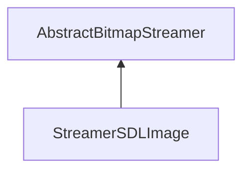

| public |
{:.api_label}

#### Inheritance Graph

## Description

## Public Functions

|
| ------: | ----------------- |
|  | |
|  | **[StreamerSDLImage](#classUtil_1_1Serialization_1_1StreamerSDLImage_1a183319b0e94b43165c8bfcebcba022b4)**() |
|  | |
|  | **[~StreamerSDLImage](#classUtil_1_1Serialization_1_1StreamerSDLImage_1aa5045e75341de5120bb4849dfc08f6c5)**() |
|  | |
| [Reference](classUtil_1_1Reference) < [Bitmap](classUtil_1_1Bitmap) > | **[loadBitmap](#classUtil_1_1Serialization_1_1StreamerSDLImage_1adf380652c2591ed1793bb3d4097e0e99)**(std::istream & void) |
{: .nohead .nowrap1 .api_section }

## Public Static Functions

|
| ------: | ----------------- |
|  | |
| bool | **[init](#classUtil_1_1Serialization_1_1StreamerSDLImage_1a5a682fa047f202b8b1e4a4886bbeded7)**() |
{: .nohead .nowrap1 .api_section }

-------------------------------------------------------------------

## Documentation

### <small>function</small>  Util::Serialization::StreamerSDLImage::StreamerSDLImage {#classUtil_1_1Serialization_1_1StreamerSDLImage_1a183319b0e94b43165c8bfcebcba022b4}

| public | inline |
{:.api_label}

|
| ------: | ----------------- |
|  |
|  **[StreamerSDLImage](#classUtil_1_1Serialization_1_1StreamerSDLImage_1a183319b0e94b43165c8bfcebcba022b4)**( |  ) |
{: .nohead .nowrap1 .api_doc }

Defined in `Util/Serialization/StreamerSDLImage.h:26`{:style="float: right"}

-------------------------------------------------------------------

### <small>function</small>  Util::Serialization::StreamerSDLImage::~StreamerSDLImage {#classUtil_1_1Serialization_1_1StreamerSDLImage_1aa5045e75341de5120bb4849dfc08f6c5}

| public | inline | virtual |
{:.api_label}

|
| ------: | ----------------- |
|  |
|  **[~StreamerSDLImage](#classUtil_1_1Serialization_1_1StreamerSDLImage_1aa5045e75341de5120bb4849dfc08f6c5)**( |  ) |
{: .nohead .nowrap1 .api_doc }

Defined in `Util/Serialization/StreamerSDLImage.h:29`{:style="float: right"}

-------------------------------------------------------------------

### <small>function</small>  Util::Serialization::StreamerSDLImage::loadBitmap {#classUtil_1_1Serialization_1_1StreamerSDLImage_1adf380652c2591ed1793bb3d4097e0e99}

| public | virtual |
{:.api_label}

|
| ------: | ----------------- |
|  |
| [Reference](classUtil_1_1Reference) < [Bitmap](classUtil_1_1Bitmap) > **[loadBitmap](#classUtil_1_1Serialization_1_1StreamerSDLImage_1adf380652c2591ed1793bb3d4097e0e99)**( | std::istream & | **void** ) |
{: .nohead .nowrap1 .api_doc }

Load a bitmap from the given stream.

#### Parameters
**input**
:  Use the data from the stream beginning at the preset position.

#### Returns
 [Bitmap](classUtil_1_1Bitmap) object. The caller is responsible for the memory deallocation.

Defined in `Util/Serialization/StreamerSDLImage.h:32`{:style="float: right"}

-------------------------------------------------------------------

### <small>function</small>  Util::Serialization::StreamerSDLImage::init {#classUtil_1_1Serialization_1_1StreamerSDLImage_1a5a682fa047f202b8b1e4a4886bbeded7}

| public | static |
{:.api_label}

|
| ------: | ----------------- |
|  |
| bool **[init](#classUtil_1_1Serialization_1_1StreamerSDLImage_1a5a682fa047f202b8b1e4a4886bbeded7)**( |  ) |
{: .nohead .nowrap1 .api_doc }

Defined in `Util/Serialization/StreamerSDLImage.h:34`{:style="float: right"}

-------------------------------------------------------------------

