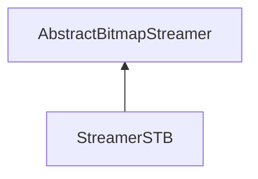

| public |
{:.api_label}

#### Inheritance Graph

## Description

## Public Functions

|
| ------: | ----------------- |
|  | |
|  | **[StreamerSTB](#classUtil_1_1Serialization_1_1StreamerSTB_1a9146c1dc768fff7df6f64e1eb340b10c)**() |
|  | |
|  | **[~StreamerSTB](#classUtil_1_1Serialization_1_1StreamerSTB_1a8288fafa010849e640c7addef9da6f22)**() |
|  | |
| [Reference](classUtil_1_1Reference) < [Bitmap](classUtil_1_1Bitmap) > | **[loadBitmap](#classUtil_1_1Serialization_1_1StreamerSTB_1ac6d493a4c97668ee804acf054408b411)**(std::istream & void) |
|  | |
| bool | **[saveBitmap](#classUtil_1_1Serialization_1_1StreamerSTB_1ae5513c257f41a13123c9eb7652058de9)**(const [Bitmap](classUtil_1_1Bitmap) & void, std::ostream & void) |
{: .nohead .nowrap1 .api_section }

## Public Static Functions

|
| ------: | ----------------- |
|  | |
| bool | **[init](#classUtil_1_1Serialization_1_1StreamerSTB_1ac79df4039bde203a439f76f7a9b8abda)**() |
{: .nohead .nowrap1 .api_section }

-------------------------------------------------------------------

## Documentation

### <small>function</small>  Util::Serialization::StreamerSTB::StreamerSTB {#classUtil_1_1Serialization_1_1StreamerSTB_1a9146c1dc768fff7df6f64e1eb340b10c}

| public | inline |
{:.api_label}

|
| ------: | ----------------- |
|  |
|  **[StreamerSTB](#classUtil_1_1Serialization_1_1StreamerSTB_1a9146c1dc768fff7df6f64e1eb340b10c)**( |  ) |
{: .nohead .nowrap1 .api_doc }

Defined in `Util/Serialization/StreamerSTB.h:27`{:style="float: right"}

-------------------------------------------------------------------

### <small>function</small>  Util::Serialization::StreamerSTB::~StreamerSTB {#classUtil_1_1Serialization_1_1StreamerSTB_1a8288fafa010849e640c7addef9da6f22}

| public | inline | virtual |
{:.api_label}

|
| ------: | ----------------- |
|  |
|  **[~StreamerSTB](#classUtil_1_1Serialization_1_1StreamerSTB_1a8288fafa010849e640c7addef9da6f22)**( |  ) |
{: .nohead .nowrap1 .api_doc }

Defined in `Util/Serialization/StreamerSTB.h:30`{:style="float: right"}

-------------------------------------------------------------------

### <small>function</small>  Util::Serialization::StreamerSTB::loadBitmap {#classUtil_1_1Serialization_1_1StreamerSTB_1ac6d493a4c97668ee804acf054408b411}

| public | virtual |
{:.api_label}

|
| ------: | ----------------- |
|  |
| [Reference](classUtil_1_1Reference) < [Bitmap](classUtil_1_1Bitmap) > **[loadBitmap](#classUtil_1_1Serialization_1_1StreamerSTB_1ac6d493a4c97668ee804acf054408b411)**( | std::istream & | **void** ) |
{: .nohead .nowrap1 .api_doc }

Load a bitmap from the given stream.

#### Parameters
**input**
:  Use the data from the stream beginning at the preset position.

#### Returns
 [Bitmap](classUtil_1_1Bitmap) object. The caller is responsible for the memory deallocation.

Defined in `Util/Serialization/StreamerSTB.h:33`{:style="float: right"}

-------------------------------------------------------------------

### <small>function</small>  Util::Serialization::StreamerSTB::saveBitmap {#classUtil_1_1Serialization_1_1StreamerSTB_1ae5513c257f41a13123c9eb7652058de9}

| public | virtual |
{:.api_label}

|
| ------: | ----------------- |
|  |
| bool **[saveBitmap](#classUtil_1_1Serialization_1_1StreamerSTB_1ae5513c257f41a13123c9eb7652058de9)**( | const [Bitmap](classUtil_1_1Bitmap) & | **void**, |
| | std::ostream & | **void** |
|   ) |
{: .nohead .nowrap1 .api_doc }

Save a bitmap to the given stream.

#### Parameters
**bitmap**
:   [Bitmap](classUtil_1_1Bitmap) object to save.

**output**
:  Use the stream for writing beginning at the preset position.

#### Returns
`true`if successful,`false`otherwise.

Defined in `Util/Serialization/StreamerSTB.h:34`{:style="float: right"}

-------------------------------------------------------------------

### <small>function</small>  Util::Serialization::StreamerSTB::init {#classUtil_1_1Serialization_1_1StreamerSTB_1ac79df4039bde203a439f76f7a9b8abda}

| public | static |
{:.api_label}

|
| ------: | ----------------- |
|  |
| bool **[init](#classUtil_1_1Serialization_1_1StreamerSTB_1ac79df4039bde203a439f76f7a9b8abda)**( |  ) |
{: .nohead .nowrap1 .api_doc }

Defined in `Util/Serialization/StreamerSTB.h:36`{:style="float: right"}

-------------------------------------------------------------------

