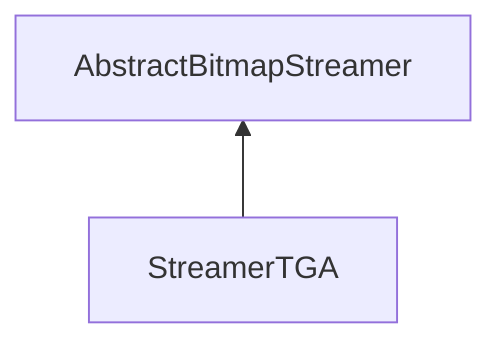

| public |
{:.api_label}

#### Inheritance Graph

## Description

## Public Functions

|
| ------: | ----------------- |
|  | |
|  | **[StreamerTGA](#classUtil_1_1Serialization_1_1StreamerTGA_1a836cb57921ea8388155a1947de92d994)**() |
|  | |
|  | **[~StreamerTGA](#classUtil_1_1Serialization_1_1StreamerTGA_1a6f578956bb11b022764eaa59c1850080)**() |
|  | |
| [Reference](classUtil_1_1Reference) < [Bitmap](classUtil_1_1Bitmap) > | **[loadBitmap](#classUtil_1_1Serialization_1_1StreamerTGA_1a21c179a3e12b822070ed189c8d395d33)**(std::istream & void) |
{: .nohead .nowrap1 .api_section }

## Public Static Functions

|
| ------: | ----------------- |
|  | |
| bool | **[init](#classUtil_1_1Serialization_1_1StreamerTGA_1ab9f121ea986f6cd8680f5c995bd179db)**() |
{: .nohead .nowrap1 .api_section }

-------------------------------------------------------------------

## Documentation

### <small>function</small>  Util::Serialization::StreamerTGA::StreamerTGA {#classUtil_1_1Serialization_1_1StreamerTGA_1a836cb57921ea8388155a1947de92d994}

| public | inline |
{:.api_label}

|
| ------: | ----------------- |
|  |
|  **[StreamerTGA](#classUtil_1_1Serialization_1_1StreamerTGA_1a836cb57921ea8388155a1947de92d994)**( |  ) |
{: .nohead .nowrap1 .api_doc }

Defined in `Util/Serialization/StreamerTGA.h:27`{:style="float: right"}

-------------------------------------------------------------------

### <small>function</small>  Util::Serialization::StreamerTGA::~StreamerTGA {#classUtil_1_1Serialization_1_1StreamerTGA_1a6f578956bb11b022764eaa59c1850080}

| public | inline | virtual |
{:.api_label}

|
| ------: | ----------------- |
|  |
|  **[~StreamerTGA](#classUtil_1_1Serialization_1_1StreamerTGA_1a6f578956bb11b022764eaa59c1850080)**( |  ) |
{: .nohead .nowrap1 .api_doc }

Defined in `Util/Serialization/StreamerTGA.h:30`{:style="float: right"}

-------------------------------------------------------------------

### <small>function</small>  Util::Serialization::StreamerTGA::loadBitmap {#classUtil_1_1Serialization_1_1StreamerTGA_1a21c179a3e12b822070ed189c8d395d33}

| public | virtual |
{:.api_label}

|
| ------: | ----------------- |
|  |
| [Reference](classUtil_1_1Reference) < [Bitmap](classUtil_1_1Bitmap) > **[loadBitmap](#classUtil_1_1Serialization_1_1StreamerTGA_1a21c179a3e12b822070ed189c8d395d33)**( | std::istream & | **void** ) |
{: .nohead .nowrap1 .api_doc }

Load a bitmap from the given stream.

#### Parameters
**input**
:  Use the data from the stream beginning at the preset position.

#### Returns
 [Bitmap](classUtil_1_1Bitmap) object. The caller is responsible for the memory deallocation.

Defined in `Util/Serialization/StreamerTGA.h:33`{:style="float: right"}

-------------------------------------------------------------------

### <small>function</small>  Util::Serialization::StreamerTGA::init {#classUtil_1_1Serialization_1_1StreamerTGA_1ab9f121ea986f6cd8680f5c995bd179db}

| public | static |
{:.api_label}

|
| ------: | ----------------- |
|  |
| bool **[init](#classUtil_1_1Serialization_1_1StreamerTGA_1ab9f121ea986f6cd8680f5c995bd179db)**( |  ) |
{: .nohead .nowrap1 .api_doc }

Defined in `Util/Serialization/StreamerTGA.h:35`{:style="float: right"}

-------------------------------------------------------------------

