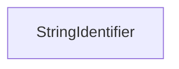

| public |
{:.api_label}

#### Inheritance Graph

## Description

String identifiers map a string to a number. This mapping is guaranteed to be unique during one execution of the program.

**Author**: Claudius Jähn, Benjamin Eikel

## Public Functions

|
| ------: | ----------------- |
|  | |
|  | **[StringIdentifier](#classUtil_1_1StringIdentifier_1a1aa60ea95584f0f5a15eb42ecfe90929)**() |
|  | |
|  | **[StringIdentifier](#classUtil_1_1StringIdentifier_1a719f8034708abd6e7a6a65fd9316dcec)**(uint32_t _id) |
|  | |
|  | **[StringIdentifier](#classUtil_1_1StringIdentifier_1a1ebf5a4fcc056b18c04be0dc71fa06c7)**(const std::string & str) |
|  | |
| uint32_t | **[getValue](#classUtil_1_1StringIdentifier_1a97c64ea1751851b11dc033ef873486de)**() const |
|  | |
| std::string | **[toString](#classUtil_1_1StringIdentifier_1ac3bc91152b33716214754cacaf250515)**() const |
|  | |
| [StringIdentifier](classUtil_1_1StringIdentifier) & | **[operator=](#classUtil_1_1StringIdentifier_1a37f81f9bcc9d1f1fc41c4294d83aa655)**(const std::string & str) |
|  | |
| bool | **[empty](#classUtil_1_1StringIdentifier_1a2f76d170a1dbc0653cb822cd24117934)**() const |
|  | |
| bool | **[operator==](#classUtil_1_1StringIdentifier_1ab4986b22ef29b2d84ee9994cd8c831f5)**(const [StringIdentifier](classUtil_1_1StringIdentifier) & other) const |
|  | |
| bool | **[operator!=](#classUtil_1_1StringIdentifier_1ac7319fdda27b4459bd164a1e32d1c09a)**(const [StringIdentifier](classUtil_1_1StringIdentifier) & other) const |
|  | |
| bool | **[operator&lt;](#classUtil_1_1StringIdentifier_1a4578835c112af25b92eded702b7704e9)**(const [StringIdentifier](classUtil_1_1StringIdentifier) & other) const |
{: .nohead .nowrap1 .api_section }

-------------------------------------------------------------------

## Documentation

### <small>function</small>  Util::StringIdentifier::StringIdentifier {#classUtil_1_1StringIdentifier_1a1aa60ea95584f0f5a15eb42ecfe90929}

| public | inline |
{:.api_label}

|
| ------: | ----------------- |
|  |
|  **[StringIdentifier](#classUtil_1_1StringIdentifier_1a1aa60ea95584f0f5a15eb42ecfe90929)**( |  ) |
{: .nohead .nowrap1 .api_doc }

Defined in `Util/StringIdentifier.h:33`{:style="float: right"}

-------------------------------------------------------------------

### <small>function</small>  Util::StringIdentifier::StringIdentifier {#classUtil_1_1StringIdentifier_1a719f8034708abd6e7a6a65fd9316dcec}

| public | inline | explicit |
{:.api_label}

|
| ------: | ----------------- |
|  |
|  **[StringIdentifier](#classUtil_1_1StringIdentifier_1a719f8034708abd6e7a6a65fd9316dcec)**( | uint32_t | **_id** ) |
{: .nohead .nowrap1 .api_doc }

Defined in `Util/StringIdentifier.h:34`{:style="float: right"}

-------------------------------------------------------------------

### <small>function</small>  Util::StringIdentifier::StringIdentifier {#classUtil_1_1StringIdentifier_1a1ebf5a4fcc056b18c04be0dc71fa06c7}

| public | inline |
{:.api_label}

|
| ------: | ----------------- |
|  |
|  **[StringIdentifier](#classUtil_1_1StringIdentifier_1a1ebf5a4fcc056b18c04be0dc71fa06c7)**( | const std::string & | **str** ) |
{: .nohead .nowrap1 .api_doc }

Defined in `Util/StringIdentifier.h:35`{:style="float: right"}

-------------------------------------------------------------------

### <small>function</small>  Util::StringIdentifier::getValue {#classUtil_1_1StringIdentifier_1a97c64ea1751851b11dc033ef873486de}

| public | const | inline |
{:.api_label}

|
| ------: | ----------------- |
|  |
| uint32_t **[getValue](#classUtil_1_1StringIdentifier_1a97c64ea1751851b11dc033ef873486de)**( |  ) const |
{: .nohead .nowrap1 .api_doc }

Defined in `Util/StringIdentifier.h:37`{:style="float: right"}

-------------------------------------------------------------------

### <small>function</small>  Util::StringIdentifier::toString {#classUtil_1_1StringIdentifier_1ac3bc91152b33716214754cacaf250515}

| public | const |
{:.api_label}

|
| ------: | ----------------- |
|  |
| std::string **[toString](#classUtil_1_1StringIdentifier_1ac3bc91152b33716214754cacaf250515)**( |  ) const |
{: .nohead .nowrap1 .api_doc }

Defined in `Util/StringIdentifier.h:38`{:style="float: right"}

-------------------------------------------------------------------

### <small>function</small>  Util::StringIdentifier::operator= {#classUtil_1_1StringIdentifier_1a37f81f9bcc9d1f1fc41c4294d83aa655}

| public | inline |
{:.api_label}

|
| ------: | ----------------- |
|  |
| [StringIdentifier](classUtil_1_1StringIdentifier) & **[operator=](#classUtil_1_1StringIdentifier_1a37f81f9bcc9d1f1fc41c4294d83aa655)**( | const std::string & | **str** ) |
{: .nohead .nowrap1 .api_doc }

Defined in `Util/StringIdentifier.h:40`{:style="float: right"}

-------------------------------------------------------------------

### <small>function</small>  Util::StringIdentifier::empty {#classUtil_1_1StringIdentifier_1a2f76d170a1dbc0653cb822cd24117934}

| public | const | inline |
{:.api_label}

|
| ------: | ----------------- |
|  |
| bool **[empty](#classUtil_1_1StringIdentifier_1a2f76d170a1dbc0653cb822cd24117934)**( |  ) const |
{: .nohead .nowrap1 .api_doc }

Defined in `Util/StringIdentifier.h:44`{:style="float: right"}

-------------------------------------------------------------------

### <small>function</small>  Util::StringIdentifier::operator== {#classUtil_1_1StringIdentifier_1ab4986b22ef29b2d84ee9994cd8c831f5}

| public | const | inline |
{:.api_label}

|
| ------: | ----------------- |
|  |
| bool **[operator==](#classUtil_1_1StringIdentifier_1ab4986b22ef29b2d84ee9994cd8c831f5)**( | const [StringIdentifier](classUtil_1_1StringIdentifier) & | **other** ) const |
{: .nohead .nowrap1 .api_doc }

Defined in `Util/StringIdentifier.h:46`{:style="float: right"}

-------------------------------------------------------------------

### <small>function</small>  Util::StringIdentifier::operator!= {#classUtil_1_1StringIdentifier_1ac7319fdda27b4459bd164a1e32d1c09a}

| public | const | inline |
{:.api_label}

|
| ------: | ----------------- |
|  |
| bool **[operator!=](#classUtil_1_1StringIdentifier_1ac7319fdda27b4459bd164a1e32d1c09a)**( | const [StringIdentifier](classUtil_1_1StringIdentifier) & | **other** ) const |
{: .nohead .nowrap1 .api_doc }

Defined in `Util/StringIdentifier.h:47`{:style="float: right"}

-------------------------------------------------------------------

### <small>function</small>  Util::StringIdentifier::operator&lt; {#classUtil_1_1StringIdentifier_1a4578835c112af25b92eded702b7704e9}

| public | const | inline |
{:.api_label}

|
| ------: | ----------------- |
|  |
| bool **[operator&lt;](#classUtil_1_1StringIdentifier_1a4578835c112af25b92eded702b7704e9)**( | const [StringIdentifier](classUtil_1_1StringIdentifier) & | **other** ) const |
{: .nohead .nowrap1 .api_doc }

Defined in `Util/StringIdentifier.h:48`{:style="float: right"}

-------------------------------------------------------------------

