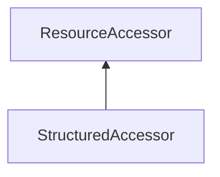

| public |
{:.api_label}

#### Inheritance Graph

## Description

 [StructuredAccessor](classUtil_1_1StructuredAccessor) 

## Public Types

|
| ------: | ----------------- |
|  | |
| typedef T | **[Type_t](#classUtil_1_1StructuredAccessor_1a576d62ea7022b674103a3366a0caf7c7)**  |
{: .nohead .nowrap1 .api_section }

## Public Functions

|
| ------: | ----------------- |
|  | |
|  | **[StructuredAccessor](#classUtil_1_1StructuredAccessor_1aa2462fb05bed75b91111b834f72c6ab8)**(uint8_t * ptr, size_t size,  [ResourceFormat](classUtil_1_1ResourceFormat)  format) |
|  | |
|  | **[~StructuredAccessor](#classUtil_1_1StructuredAccessor_1ae7a9219081f267c4c3e614a3af6b46a0)**() |
|  | |
| [Type_t](classUtil_1_1StructuredAccessor#classUtil_1_1StructuredAccessor_1a576d62ea7022b674103a3366a0caf7c7) | **[read](#classUtil_1_1StructuredAccessor_1a34e0e85f4418eaf00bfc909d10851dd9)**(size_t index) |
|  | |
| std::vector< [Type_t](classUtil_1_1StructuredAccessor#classUtil_1_1StructuredAccessor_1a576d62ea7022b674103a3366a0caf7c7) > | **[read](#classUtil_1_1StructuredAccessor_1a5df2fff8804e5527975d013146e8c2bc)**(size_t index, size_t count) |
|  | |
| void | **[write](#classUtil_1_1StructuredAccessor_1af32fdc46cd4b081343bcabbcccb08356)**(size_t index, const [Type_t](classUtil_1_1StructuredAccessor#classUtil_1_1StructuredAccessor_1a576d62ea7022b674103a3366a0caf7c7) & value) |
|  | |
| void | **[write](#classUtil_1_1StructuredAccessor_1ab95d316e0e72dc38d089bc25cea8cd47)**(size_t index, const std::vector< [Type_t](classUtil_1_1StructuredAccessor#classUtil_1_1StructuredAccessor_1a576d62ea7022b674103a3366a0caf7c7) > & values) |
{: .nohead .nowrap1 .api_section }

-------------------------------------------------------------------

## Documentation

### <small>typedef</small>  Util::StructuredAccessor::Type_t {#classUtil_1_1StructuredAccessor_1a576d62ea7022b674103a3366a0caf7c7}

| public |
{:.api_label}

|
| ------: | ----------------- |
|  |
| typedef T **[Type_t](#classUtil_1_1StructuredAccessor_1a576d62ea7022b674103a3366a0caf7c7)**  |
{: .nohead .nowrap1 .api_doc }

Defined in `Util/Resources/StructuredAccessor.h:22`{:style="float: right"}

-------------------------------------------------------------------

### <small>function</small>  Util::StructuredAccessor::StructuredAccessor {#classUtil_1_1StructuredAccessor_1aa2462fb05bed75b91111b834f72c6ab8}

| public | inline |
{:.api_label}

|
| ------: | ----------------- |
|  |
|  **[StructuredAccessor](#classUtil_1_1StructuredAccessor_1aa2462fb05bed75b91111b834f72c6ab8)**( | uint8_t * | **ptr**, |
| | size_t | **size**, |
| |  [ResourceFormat](classUtil_1_1ResourceFormat)  | **format** |
|   ) |
{: .nohead .nowrap1 .api_doc }

Defined in `Util/Resources/StructuredAccessor.h:24`{:style="float: right"}

-------------------------------------------------------------------

### <small>function</small>  Util::StructuredAccessor::~StructuredAccessor {#classUtil_1_1StructuredAccessor_1ae7a9219081f267c4c3e614a3af6b46a0}

| public | virtual |
{:.api_label}

|
| ------: | ----------------- |
|  |
|  **[~StructuredAccessor](#classUtil_1_1StructuredAccessor_1ae7a9219081f267c4c3e614a3af6b46a0)**( |  ) |
{: .nohead .nowrap1 .api_doc }

Defined in `Util/Resources/StructuredAccessor.h:25`{:style="float: right"}

-------------------------------------------------------------------

### <small>function</small>  Util::StructuredAccessor::read {#classUtil_1_1StructuredAccessor_1a34e0e85f4418eaf00bfc909d10851dd9}

| public | inline |
{:.api_label}

|
| ------: | ----------------- |
|  |
| [Type_t](classUtil_1_1StructuredAccessor#classUtil_1_1StructuredAccessor_1a576d62ea7022b674103a3366a0caf7c7) **[read](#classUtil_1_1StructuredAccessor_1a34e0e85f4418eaf00bfc909d10851dd9)**( | size_t | **index** ) |
{: .nohead .nowrap1 .api_doc }

Defined in `Util/Resources/StructuredAccessor.h:27`{:style="float: right"}

-------------------------------------------------------------------

### <small>function</small>  Util::StructuredAccessor::read {#classUtil_1_1StructuredAccessor_1a5df2fff8804e5527975d013146e8c2bc}

| public | inline |
{:.api_label}

|
| ------: | ----------------- |
|  |
| std::vector< [Type_t](classUtil_1_1StructuredAccessor#classUtil_1_1StructuredAccessor_1a576d62ea7022b674103a3366a0caf7c7) > **[read](#classUtil_1_1StructuredAccessor_1a5df2fff8804e5527975d013146e8c2bc)**( | size_t | **index**, |
| | size_t | **count** |
|   ) |
{: .nohead .nowrap1 .api_doc }

Defined in `Util/Resources/StructuredAccessor.h:33`{:style="float: right"}

-------------------------------------------------------------------

### <small>function</small>  Util::StructuredAccessor::write {#classUtil_1_1StructuredAccessor_1af32fdc46cd4b081343bcabbcccb08356}

| public | inline |
{:.api_label}

|
| ------: | ----------------- |
|  |
| void **[write](#classUtil_1_1StructuredAccessor_1af32fdc46cd4b081343bcabbcccb08356)**( | size_t | **index**, |
| | const [Type_t](classUtil_1_1StructuredAccessor#classUtil_1_1StructuredAccessor_1a576d62ea7022b674103a3366a0caf7c7) & | **value** |
|   ) |
{: .nohead .nowrap1 .api_doc }

Defined in `Util/Resources/StructuredAccessor.h:39`{:style="float: right"}

-------------------------------------------------------------------

### <small>function</small>  Util::StructuredAccessor::write {#classUtil_1_1StructuredAccessor_1ab95d316e0e72dc38d089bc25cea8cd47}

| public | inline |
{:.api_label}

|
| ------: | ----------------- |
|  |
| void **[write](#classUtil_1_1StructuredAccessor_1ab95d316e0e72dc38d089bc25cea8cd47)**( | size_t | **index**, |
| | const std::vector< [Type_t](classUtil_1_1StructuredAccessor#classUtil_1_1StructuredAccessor_1a576d62ea7022b674103a3366a0caf7c7) > & | **values** |
|   ) |
{: .nohead .nowrap1 .api_doc }

Defined in `Util/Resources/StructuredAccessor.h:43`{:style="float: right"}

-------------------------------------------------------------------

