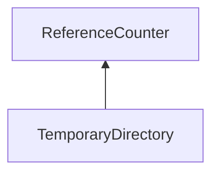

| public |
{:.api_label}

#### Inheritance Graph

## Description

Creation and deletion of temporary directories.

When creating an object of this class, a new directory is created, which can be used to store temporary files. When the object is destroyed, the directory will be deleted together with all files inside.

**Author**: Benjamin Eikel

**Date**: 2011-08-15

## Public Functions

|
| ------: | ----------------- |
|  | |
|  | **[TemporaryDirectory](#classUtil_1_1TemporaryDirectory_1a204a6bf82d978ff962a67f5463ce97b2)**(const std::string & fragment) |
|  | |
|  | **[~TemporaryDirectory](#classUtil_1_1TemporaryDirectory_1a19440e71622565f0741ce17939a6c948)**()   Delete the directory and all its contents. |
|  | |
| const [FileName](classUtil_1_1FileName) & | **[getPath](#classUtil_1_1TemporaryDirectory_1a0a4acbad403f9cbffd6de8e0ae459b3f)**() const |
{: .nohead .nowrap1 .api_section }

-------------------------------------------------------------------

## Documentation

### <small>function</small>  Util::TemporaryDirectory::TemporaryDirectory {#classUtil_1_1TemporaryDirectory_1a204a6bf82d978ff962a67f5463ce97b2}

| public |
{:.api_label}

|
| ------: | ----------------- |
|  |
|  **[TemporaryDirectory](#classUtil_1_1TemporaryDirectory_1a204a6bf82d978ff962a67f5463ce97b2)**( | const std::string & | **fragment** ) |
{: .nohead .nowrap1 .api_doc }

Create a new temporary directory. The part will contain the current process identifier, an automatically increasing counter and the given fragment.

#### Parameters
**fragment**
:  String that will be used as part of the path. This must not contain characters that are invalid in file names.

Defined in `Util/IO/TemporaryDirectory.h:49`{:style="float: right"}

-------------------------------------------------------------------

### <small>function</small>  Util::TemporaryDirectory::~TemporaryDirectory {#classUtil_1_1TemporaryDirectory_1a19440e71622565f0741ce17939a6c948}

| public |
{:.api_label}

|
| ------: | ----------------- |
|  |
|  **[~TemporaryDirectory](#classUtil_1_1TemporaryDirectory_1a19440e71622565f0741ce17939a6c948)**( |  ) |
{: .nohead .nowrap1 .api_doc }

Delete the directory and all its contents.

Defined in `Util/IO/TemporaryDirectory.h:52`{:style="float: right"}

-------------------------------------------------------------------

### <small>function</small>  Util::TemporaryDirectory::getPath {#classUtil_1_1TemporaryDirectory_1a0a4acbad403f9cbffd6de8e0ae459b3f}

| public | const | inline |
{:.api_label}

|
| ------: | ----------------- |
|  |
| const [FileName](classUtil_1_1FileName) & **[getPath](#classUtil_1_1TemporaryDirectory_1a0a4acbad403f9cbffd6de8e0ae459b3f)**( |  ) const |
{: .nohead .nowrap1 .api_doc }

Retrieve the path to the directory.

#### Returns
Directory location that can be used for temporary files.

Defined in `Util/IO/TemporaryDirectory.h:59`{:style="float: right"}

-------------------------------------------------------------------

