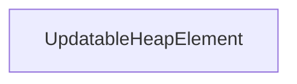

| public |
{:.api_label}

#### Inheritance Graph

## Description

## Public Attributes

|
| ------: | ----------------- |
|  | |
| Data_t | **[data](#classUtil_1_1UpdatableHeap_1_1UpdatableHeapElement_1a57ed17c0287226528652343e97120abc)**  |
{: .nohead .nowrap1 .api_section }

## Public Functions

|
| ------: | ----------------- |
|  | |
|  | **[UpdatableHeapElement](#classUtil_1_1UpdatableHeap_1_1UpdatableHeapElement_1aa48698ec70d48e190ffc0403e1e10e04)**( [UpdatableHeapElement](classUtil_1_1UpdatableHeap_1_1UpdatableHeapElement) * parentElement) |
|  | |
| Key_t | **[getCost](#classUtil_1_1UpdatableHeap_1_1UpdatableHeapElement_1a66b003eb17b73004094b99b5f47fb5fd)**() const |
{: .nohead .nowrap1 .api_section }

-------------------------------------------------------------------

## Documentation

### <small>variable</small>  Util::UpdatableHeap::UpdatableHeapElement::data {#classUtil_1_1UpdatableHeap_1_1UpdatableHeapElement_1a57ed17c0287226528652343e97120abc}

| public |
{:.api_label}

|
| ------: | ----------------- |
|  |
| Data_t **[data](#classUtil_1_1UpdatableHeap_1_1UpdatableHeapElement_1a57ed17c0287226528652343e97120abc)**  |
{: .nohead .nowrap1 .api_doc }

Defined in `Util/UpdatableHeap.h:43`{:style="float: right"}

-------------------------------------------------------------------

### <small>function</small>  Util::UpdatableHeap::UpdatableHeapElement::UpdatableHeapElement {#classUtil_1_1UpdatableHeap_1_1UpdatableHeapElement_1aa48698ec70d48e190ffc0403e1e10e04}

| public | inline |
{:.api_label}

|
| ------: | ----------------- |
|  |
|  **[UpdatableHeapElement](#classUtil_1_1UpdatableHeap_1_1UpdatableHeapElement_1aa48698ec70d48e190ffc0403e1e10e04)**( |  [UpdatableHeapElement](classUtil_1_1UpdatableHeap_1_1UpdatableHeapElement) * | **parentElement** ) |
{: .nohead .nowrap1 .api_doc }

Defined in `Util/UpdatableHeap.h:40`{:style="float: right"}

-------------------------------------------------------------------

### <small>function</small>  Util::UpdatableHeap::UpdatableHeapElement::getCost {#classUtil_1_1UpdatableHeap_1_1UpdatableHeapElement_1a66b003eb17b73004094b99b5f47fb5fd}

| public | const | inline |
{:.api_label}

|
| ------: | ----------------- |
|  |
| Key_t **[getCost](#classUtil_1_1UpdatableHeap_1_1UpdatableHeapElement_1a66b003eb17b73004094b99b5f47fb5fd)**( |  ) const |
{: .nohead .nowrap1 .api_doc }

Defined in `Util/UpdatableHeap.h:45`{:style="float: right"}

-------------------------------------------------------------------

