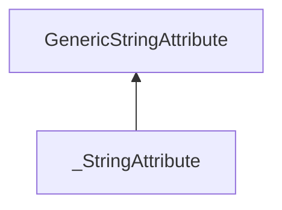

| public |
{:.api_label}

#### Inheritance Graph

## Description

 [Generic](classUtil_1_1Generic) attribute to store a string.

## Public Types

|
| ------: | ----------------- |
|  | |
| typedef [_StringAttribute](classUtil_1_1%5F%5FStringAttribute) < StringType > | **[attr_t](#classUtil_1_1%5F%5FStringAttribute_1a96030e558c51947c7654fbe6a38b69f3)**  |
{: .nohead .nowrap1 .api_section }

## Public Functions

|
| ------: | ----------------- |
| template< typename other_string_t , typename  >  | |
|  | **[_StringAttribute](#classUtil_1_1%5F%5FStringAttribute_1a4b482c0f77dc877e768d631ffc08d338)**(other_string_t && otherString)   Construct the attribute taking a convertible string as parameter. |
|  | |
|  | **[~_StringAttribute](#classUtil_1_1%5F%5FStringAttribute_1a1bcc55c043c814430fd50828ff641c7c)**() |
|  | |
| const StringType & | **[get](#classUtil_1_1%5F%5FStringAttribute_1ab21df0ed8959e479c764e6f2cc9bd0ca)**() const |
|  | |
| void | **[set](#classUtil_1_1%5F%5FStringAttribute_1a7c93a005785d5500c7fa260b812f92fd)**(const StringType & newString) |
|  | |
| [attr_t](classUtil_1_1GenericAttribute#classUtil_1_1GenericAttribute_1a5379a828be73ce58bb05e4ef27e8a3e7) * | **[clone](#classUtil_1_1%5F%5FStringAttribute_1ae0c212db86b5db2946189b274f8da108)**() const |
|  | |
| bool | **[toBool](#classUtil_1_1%5F%5FStringAttribute_1af759379f623cab2636419e256ce1fee6)**() const   returns true iff the string is "true", "TRUE" or "1" |
|  | |
| std::string | **[toString](#classUtil_1_1%5F%5FStringAttribute_1ab7e3ccf13557493caa4222b77f2c7cf3)**() const |
|  | |
| std::string | **[toJSON](#classUtil_1_1%5F%5FStringAttribute_1a70c6de678efe511a73df21c40a474b85)**() const |
|  | |
| double | **[toDouble](#classUtil_1_1%5F%5FStringAttribute_1ad8b26180c5682f4febb5e88454f362af)**() const |
|  | |
| float | **[toFloat](#classUtil_1_1%5F%5FStringAttribute_1ad7e5c73f02dc1b5189cb18b4779a2c93)**() const |
|  | |
| int | **[toInt](#classUtil_1_1%5F%5FStringAttribute_1a79fd4e8167374af01bb3e0bfce0e2a29)**() const |
|  | |
| unsigned int | **[toUnsignedInt](#classUtil_1_1%5F%5FStringAttribute_1ae4479ce642082bd996002a1bd0040079)**() const |
|  | |
| bool | **[operator==](#classUtil_1_1%5F%5FStringAttribute_1ae3d8bdee5e4002e859aa67571d944cb3)**(const [GenericAttribute](classUtil_1_1GenericAttribute) & void) const   Per default, the comparison returns false for unspecified types. |
{: .nohead .nowrap1 .api_section }

-------------------------------------------------------------------

## Documentation

### <small>typedef</small>  Util::_StringAttribute::attr_t {#classUtil_1_1__StringAttribute_1a96030e558c51947c7654fbe6a38b69f3}

| public |
{:.api_label}

|
| ------: | ----------------- |
|  |
| typedef [_StringAttribute](classUtil_1_1%5F%5FStringAttribute) < StringType > **[attr_t](#classUtil_1_1%5F%5FStringAttribute_1a96030e558c51947c7654fbe6a38b69f3)**  |
{: .nohead .nowrap1 .api_doc }

Defined in `Util/GenericAttribute.h:417`{:style="float: right"}

-------------------------------------------------------------------

### <small>function</small>  Util::_StringAttribute::_StringAttribute {#classUtil_1_1__StringAttribute_1a4b482c0f77dc877e768d631ffc08d338}

| public | inline | explicit |
{:.api_label}

|
| ------: | ----------------- |
| template< typename other_string_t , typename  = typename std::enable_if<										std::is_convertible<											other_string_t, 											StringType>::value>::type > |
|  **[_StringAttribute](#classUtil_1_1%5F%5FStringAttribute_1a4b482c0f77dc877e768d631ffc08d338)**( | other_string_t && | **otherString** ) |
{: .nohead .nowrap1 .api_doc }

Construct the attribute taking a convertible string as parameter.

Defined in `Util/GenericAttribute.h:425`{:style="float: right"}

-------------------------------------------------------------------

### <small>function</small>  Util::_StringAttribute::~_StringAttribute {#classUtil_1_1__StringAttribute_1a1bcc55c043c814430fd50828ff641c7c}

| public | inline | virtual |
{:.api_label}

|
| ------: | ----------------- |
|  |
|  **[~_StringAttribute](#classUtil_1_1%5F%5FStringAttribute_1a1bcc55c043c814430fd50828ff641c7c)**( |  ) |
{: .nohead .nowrap1 .api_doc }

Defined in `Util/GenericAttribute.h:429`{:style="float: right"}

-------------------------------------------------------------------

### <small>function</small>  Util::_StringAttribute::get {#classUtil_1_1__StringAttribute_1ab21df0ed8959e479c764e6f2cc9bd0ca}

| public | const | inline |
{:.api_label}

|
| ------: | ----------------- |
|  |
| const StringType & **[get](#classUtil_1_1%5F%5FStringAttribute_1ab21df0ed8959e479c764e6f2cc9bd0ca)**( |  ) const |
{: .nohead .nowrap1 .api_doc }

Return a read-only reference to the stored string.

#### Returns
 [Reference](classUtil_1_1Reference) to string

Defined in `Util/GenericAttribute.h:437`{:style="float: right"}

-------------------------------------------------------------------

### <small>function</small>  Util::_StringAttribute::set {#classUtil_1_1__StringAttribute_1a7c93a005785d5500c7fa260b812f92fd}

| public | inline |
{:.api_label}

|
| ------: | ----------------- |
|  |
| void **[set](#classUtil_1_1%5F%5FStringAttribute_1a7c93a005785d5500c7fa260b812f92fd)**( | const StringType & | **newString** ) |
{: .nohead .nowrap1 .api_doc }

Replace the stored string by the given one.

#### Parameters
**newString**
:  String replacement

Defined in `Util/GenericAttribute.h:446`{:style="float: right"}

-------------------------------------------------------------------

### <small>function</small>  Util::_StringAttribute::clone {#classUtil_1_1__StringAttribute_1ae0c212db86b5db2946189b274f8da108}

| public | const | inline | virtual |
{:.api_label}

|
| ------: | ----------------- |
|  |
| [attr_t](classUtil_1_1GenericAttribute#classUtil_1_1GenericAttribute_1a5379a828be73ce58bb05e4ef27e8a3e7) * **[clone](#classUtil_1_1%5F%5FStringAttribute_1ae0c212db86b5db2946189b274f8da108)**( |  ) const |
{: .nohead .nowrap1 .api_doc }

Create a copy of this object.

#### Returns
Exact copy.

Defined in `Util/GenericAttribute.h:450`{:style="float: right"}

-------------------------------------------------------------------

### <small>function</small>  Util::_StringAttribute::toBool {#classUtil_1_1__StringAttribute_1af759379f623cab2636419e256ce1fee6}

| public | const | inline | virtual |
{:.api_label}

|
| ------: | ----------------- |
|  |
| bool **[toBool](#classUtil_1_1%5F%5FStringAttribute_1af759379f623cab2636419e256ce1fee6)**( |  ) const |
{: .nohead .nowrap1 .api_doc }

returns true iff the string is "true", "TRUE" or "1"

Defined in `Util/GenericAttribute.h:452`{:style="float: right"}

-------------------------------------------------------------------

### <small>function</small>  Util::_StringAttribute::toString {#classUtil_1_1__StringAttribute_1ab7e3ccf13557493caa4222b77f2c7cf3}

| public | const | inline | virtual |
{:.api_label}

|
| ------: | ----------------- |
|  |
| std::string **[toString](#classUtil_1_1%5F%5FStringAttribute_1ab7e3ccf13557493caa4222b77f2c7cf3)**( |  ) const |
{: .nohead .nowrap1 .api_doc }

Convert the object to a human-readable string.

#### Returns
String representation.

Defined in `Util/GenericAttribute.h:453`{:style="float: right"}

-------------------------------------------------------------------

### <small>function</small>  Util::_StringAttribute::toJSON {#classUtil_1_1__StringAttribute_1a70c6de678efe511a73df21c40a474b85}

| public | const | inline | virtual |
{:.api_label}

|
| ------: | ----------------- |
|  |
| std::string **[toJSON](#classUtil_1_1%5F%5FStringAttribute_1a70c6de678efe511a73df21c40a474b85)**( |  ) const |
{: .nohead .nowrap1 .api_doc }

Convert the object to JavaScript Object Notation (JSON).

#### Returns
JSON representation;

Defined in `Util/GenericAttribute.h:454`{:style="float: right"}

-------------------------------------------------------------------

### <small>function</small>  Util::_StringAttribute::toDouble {#classUtil_1_1__StringAttribute_1ad8b26180c5682f4febb5e88454f362af}

| public | const | inline | virtual |
{:.api_label}

|
| ------: | ----------------- |
|  |
| double **[toDouble](#classUtil_1_1%5F%5FStringAttribute_1ad8b26180c5682f4febb5e88454f362af)**( |  ) const |
{: .nohead .nowrap1 .api_doc }

Convert the object to a floating-point value with double precision.

#### Returns
Floating-point representation with double precision.

Defined in `Util/GenericAttribute.h:455`{:style="float: right"}

-------------------------------------------------------------------

### <small>function</small>  Util::_StringAttribute::toFloat {#classUtil_1_1__StringAttribute_1ad7e5c73f02dc1b5189cb18b4779a2c93}

| public | const | inline | virtual |
{:.api_label}

|
| ------: | ----------------- |
|  |
| float **[toFloat](#classUtil_1_1%5F%5FStringAttribute_1ad7e5c73f02dc1b5189cb18b4779a2c93)**( |  ) const |
{: .nohead .nowrap1 .api_doc }

Convert the object to a floating-point value.

#### Returns
Floating-point representation.

Defined in `Util/GenericAttribute.h:456`{:style="float: right"}

-------------------------------------------------------------------

### <small>function</small>  Util::_StringAttribute::toInt {#classUtil_1_1__StringAttribute_1a79fd4e8167374af01bb3e0bfce0e2a29}

| public | const | inline | virtual |
{:.api_label}

|
| ------: | ----------------- |
|  |
| int **[toInt](#classUtil_1_1%5F%5FStringAttribute_1a79fd4e8167374af01bb3e0bfce0e2a29)**( |  ) const |
{: .nohead .nowrap1 .api_doc }

Convert the object to an integer value.

#### Returns
Integer representation.

Defined in `Util/GenericAttribute.h:457`{:style="float: right"}

-------------------------------------------------------------------

### <small>function</small>  Util::_StringAttribute::toUnsignedInt {#classUtil_1_1__StringAttribute_1ae4479ce642082bd996002a1bd0040079}

| public | const | inline | virtual |
{:.api_label}

|
| ------: | ----------------- |
|  |
| unsigned int **[toUnsignedInt](#classUtil_1_1%5F%5FStringAttribute_1ae4479ce642082bd996002a1bd0040079)**( |  ) const |
{: .nohead .nowrap1 .api_doc }

Convert the object to an unsigned integer value.

#### Returns
Unsigned integer representation.

Defined in `Util/GenericAttribute.h:458`{:style="float: right"}

-------------------------------------------------------------------

### <small>function</small>  Util::_StringAttribute::operator== {#classUtil_1_1__StringAttribute_1ae3d8bdee5e4002e859aa67571d944cb3}

| public | const | inline | virtual |
{:.api_label}

|
| ------: | ----------------- |
|  |
| bool **[operator==](#classUtil_1_1%5F%5FStringAttribute_1ae3d8bdee5e4002e859aa67571d944cb3)**( | const [GenericAttribute](classUtil_1_1GenericAttribute) & | **void** ) const |
{: .nohead .nowrap1 .api_doc }

Per default, the comparison returns false for unspecified types.

Defined in `Util/GenericAttribute.h:459`{:style="float: right"}

-------------------------------------------------------------------

