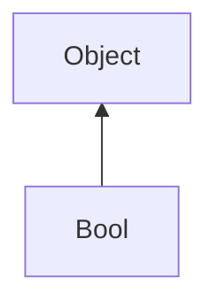

#### Inheritance Graph

## Functions

|
| -------------: | ------------------------------- | 
| **&amp;**(p0)  | Bool Bool & ((Bool)obj)         | 
| **&amp;=**(p0) | [ESMF] Bool &= Bool             | 
| **&lt;**(p0)   | [ESMF] Bool Bool < ((Bool)obj)  | 
| **&gt;**(p0)   | [ESMF] Bool Bool > ((Bool)obj)  | 
| **^**(p0)      | [ESMF] Bool Bool ^ ((Bool)obj)  | 
| **\|**(p0)     | [ESMF] Bool Bool \| ((Bool)obj) | 
| **\|=**(p0)    | [ESMF] Bool \|= Bool            | 
{: .nohead .nowrap1 }

