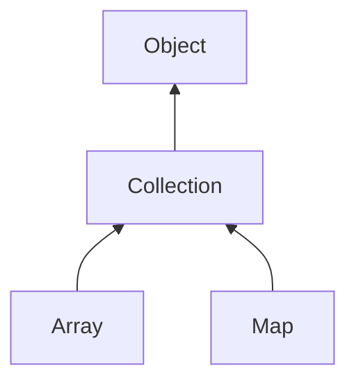

#### Inheritance Graph

## Functions

|
| ------------------------------------------------------------------------------------------------------------: | ----------------------------------------------------------------------------------------------------------------- | 
| **_get**(p0)                                                                                                  | [ESMF] Object Collection[key]                                                                                     | 
| **_set**(p0, p1)                                                                                              | [ESMF] thisObj Collection[key] = value                                                                            | 
| **[clear](classEScript_1_1Collection#classEScript_1_1Collection_1a142cc71eedfdcdda25c008dfe6e657e6)**()       | [ESMF] thisObj Collection.clear()                                                                                 | 
| **contains**(p0)                                                                                              | [ESMF] bool Collection.contains(Object)                                                                           | 
| **[count](classEScript_1_1Collection#classEScript_1_1Collection_1a55bf106b66b45e5613a590a567ce85cd)**()       | [ESMF] Number Collection.count()                                                                                  | 
| **empty**()                                                                                                   | [ESMF] Bool Collection.empty()                                                                                    | 
| **findValue**(p0)                                                                                             | [ESMF] KEY Collection.findValue( VALUE )                                                                          | 
| **[get](classEScript_1_1EPtr#classEScript_1_1EPtr_1a76f00848d9f3d49e5a55669e7abccee1)**(p0 [, p1])            | [ESMF] Object Collection.get(key [,default value] )                                                               | 
| **[getIterator](classEScript_1_1Collection#classEScript_1_1Collection_1a8603f03616e8bfb756ef307b0ab2e771)**() | [ESMF] Iterator Collection.getIterator()                                                                          | 
| **map**(p0)                                                                                                   | [ESMF] Collection Collection.map(function[, AdditionalValues\*])                                                  | 
| **max**()                                                                                                     | [ESMF] Object Collection.max()                                                                                    | 
| **min**()                                                                                                     | [ESMF] Object Collection.min()                                                                                    | 
| **reduce**(p0)                                                                                                | [ESMF] KEY Collection.reduce(fn(runningVar,key,value){ return ...}[,initialValue = void,[,additionalParameters]]) | 
| **set**(p0, p1)                                                                                               | [ESMF] thisObj Collection.set(key,value)                                                                          | 
| ~~size~~()                                                                                                    | [ESMF] Number Collection.size()  **Deprecated**                                                               | 
{: .nohead .nowrap1 }

