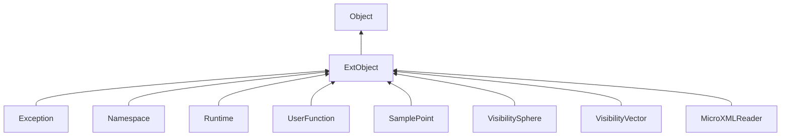

#### Inheritance Graph

## Functions

|
| ---------------------: | ---------------------------------------------------- | 
| **_constructor**([p0]) | [ESF] ExtObject new ExtObject( [Map objAttributes] ) | 
{: .nohead .nowrap1 }

