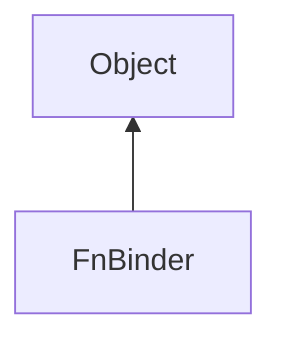

#### Inheritance Graph

## Functions

|
| ---------------------------------------------------------------------------------------------------------------: | ------------------------------------------------------------- | 
| **_constructor**(p0, p1, ...)                                                                                    | [ESF] FnBinder new FnBinder(object,function, _boundParams...) | 
| **bindParameters**(p0)                                                                                           | [ESF] FnBinder FnBinder.bindParameters( fun, p... )           | 
| **[getBoundParameters](classEScript_1_1FnBinder#classEScript_1_1FnBinder_1aba7cdb3724e25b5bdfb00abb53c5347f)**() | [ESMF] Array FnBinder.getBoundParameters()                    | 
| **[getFunction](classEScript_1_1FnBinder#classEScript_1_1FnBinder_1a0db08496991f56d2b51e57d50c072931)**()        | [ESMF] Object FnBinder.getFunction()                          | 
| **[getObject](classEScript_1_1FnBinder#classEScript_1_1FnBinder_1a926f92bbd4aa28e73c2301114e716a1a)**()          | [ESMF] Object FnBinder.getObject()                            | 
| **isObjectBound**()                                                                                              | [ESMF] Bool FnBinder.isObjectBound()                          | 
{: .nohead .nowrap1 }

