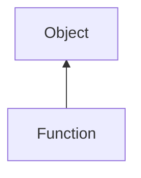

#### Inheritance Graph

## Functions

|
| -------------------------------------------------------------------------------------------------------------: | ------------------------------------------------------- | 
| **_getCallCounter**()                                                                                          | [ESMF] (experimental) Number Function._getCallCounter() | 
| **[getMaxParamCount](classEScript_1_1Function#classEScript_1_1Function_1a3ac5dccd12981fb2a4ec69fd2bea9bba)**() | [ESMF] Number\|false Function.getMaxParamCount()        | 
| **[getMinParamCount](classEScript_1_1Function#classEScript_1_1Function_1a66a74b0b6a82d248f99f8d9a3fd31524)**() | [ESMF] Number Function.getMinParamCount()               | 
| **[getOriginalName](classEScript_1_1Function#classEScript_1_1Function_1a7277022e1f51debc956e1341260a7ffa)**()  | [ESMF] Identifier Function.getOriginalName()            | 
{: .nohead .nowrap1 }

