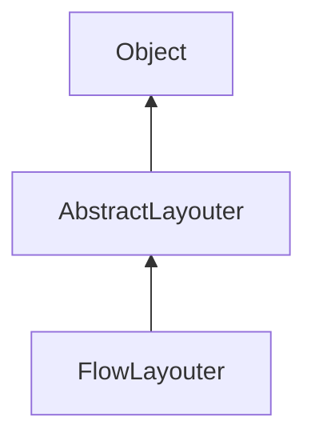

#### Inheritance Graph

```mermaid
graph BT
	AbstractLayouter
	AbstractLayouter --> Object
	FlowLayouter --> AbstractLayouter
	click AbstractLayouter "escript_type_GUI_AbstractLayouter"
	click Object "escript_type_Object"
	click FlowLayouter "escript_type_GUI_FlowLayouter"
```

