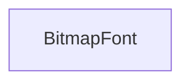

#### Inheritance Graph

## Functions

|
| -----------------------------------------------------------------------------------------------------------------------: | -------------------------------------------------------------------------------------------------------------------------------------------------------- | 
| **_constructor**(p0, p1)                                                                                                 | [ESF] BitmapFont new BitmapFont( Image,lineHeight )                                                                                                      | 
| **[addGlyph](classGUI_1_1BitmapFont#classGUI_1_1BitmapFont_1a7865ac6a085cc32550bc737c7945bb5b)**(p0, p1, p2, p3, p4, p5) | [ESMF] self BitmapFont.addGlyph( Number unicode, Number width, Number height, Geometry::Vec2 textureOffset,Geometry::Vec2 screenOffset,Number xAdvance ) | 
| **[createFont](classGUI_1_1BitmapFont#classGUI_1_1BitmapFont_1a1afcbcab284143762ee1400251daed97)**(p0, p1, p2)           | [ESF] BitmapFont new BitmapFont( FileName,Number size,String charMap)                                                                                    | 
| **[getBitmap](classGUI_1_1BitmapFont#classGUI_1_1BitmapFont_1ab01d1a41fd8cd466723cd9291c3bd747)**()                      | [ESMF] Util.Bitmap BitmapFont.getBitmap( )                                                                                                               | 
| **[setKerning](classGUI_1_1BitmapFont#classGUI_1_1BitmapFont_1a00635e08108167a6021f00be03131d99)**(p0, p1, p2)           | [ESMF] self BitmapFont.setKerning( Number unicode1,Number unicode2,Number kerning)                                                                       | 
| **[setTabWidth](classGUI_1_1BitmapFont#classGUI_1_1BitmapFont_1acacacacdb7b717fe10f86c569a66f564)**(p0)                  | [ESMF] self BitmapFont.setTabWidth( Number )                                                                                                             | 
{: .nohead .nowrap1 }

