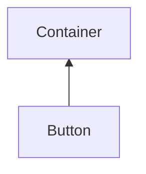

#### Inheritance Graph

## Functions

|
| -----------------------------------------------------------------------------------------------: | -------------------------------------------------- | 
| **[getText](classGUI_1_1Button#classGUI_1_1Button_1ac53bf2975bedb59b129f67f17ca28110)**()        | [ESMF] string Button.getText()                     | 
| **[isSwitchedOn](classGUI_1_1Button#classGUI_1_1Button_1af8f3f832b4edd01a0337fecd22f1f67f)**()   | [ESMF] bool Button.isSwitchedOn()                  | 
| **onClick**()                                                                                    | [ESMF] Bool Button.onClick() \note ObjectAttribute | 
| **[setColor](classGUI_1_1Button#classGUI_1_1Button_1a50fb0e1068d951d4c8668ef8ba935473)**(p0)     | [ESMF] self Button.setColor(Util.Color4)           | 
| **[setFont](classGUI_1_1Button#classGUI_1_1Button_1a182028c15c421c9896370969264dfd53)**(p0)      | [ESMF] self Button.setFont(AbstractFont f)         | 
| **[setSwitch](classGUI_1_1Button#classGUI_1_1Button_1a8a7a26849a58b64bfc412fe7af39aa0c)**(p0)    | [ESMF] self Button.setSwitch(bool)                 | 
| **[setText](classGUI_1_1Button#classGUI_1_1Button_1a89e964d353192135d6a77aeff33bbc41)**(p0)      | [ESMF] self Button.setText(string)                 | 
| **[setTextStyle](classGUI_1_1Button#classGUI_1_1Button_1ad93eeb41620c1a9d4412f7194a8166b8)**(p0) | [ESMF] self Button.setTextStyle(int i)             | 
{: .nohead .nowrap1 }

