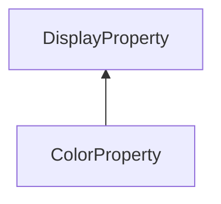

#### Inheritance Graph

## Functions

|
| -----------------------: | ------------------------------------------------------ | 
| **_constructor**(p0, p1) | [ESF] new ColorProperty(Number id,Util.Color4(ub\|f) ) | 
{: .nohead .nowrap1 }

