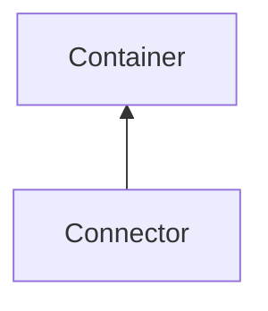

#### Inheritance Graph

## Functions

|
| -----------------------------------------------------------------------------------------------------------: | ------------------------------------------------------------ | 
| **[getFirstComponent](classGUI_1_1Connector#classGUI_1_1Connector_1aa5c5eb11868f06eebd1969fe374724ce)**()    | [ESMF] Component Connector.getFirstComponent()               | 
| **[getLength](classGUI_1_1Connector#classGUI_1_1Connector_1a89b8e26a0ec87a15d272c9c1e3a2d366)**()            | [ESMF] Number Connector.getLength()                          | 
| **[getSecondComponent](classGUI_1_1Connector#classGUI_1_1Connector_1ae817efb1e336f66af700222b06b69df3)**()   | [ESMF] Component Connector.getSecondComponent()              | 
| **[setFirstComponent](classGUI_1_1Connector#classGUI_1_1Connector_1aa6f5072bd2896b80da8d3054c527e07f)**(p0)  | [ESMF] self Connector.setFirstComponent(Component\|nullptr)  | 
| **[setSecondComponent](classGUI_1_1Connector#classGUI_1_1Connector_1a2ef4fedc409b47b1bcbff6bc1e96428b)**(p0) | [ESMF] self Connector.setSecondComponent(Component\|nullptr) | 
{: .nohead .nowrap1 }

