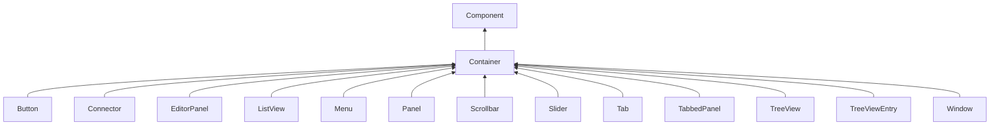

#### Inheritance Graph

## Functions

|
| ---------------------------------------------------------------------------------------------------------: | ---------------------------------------------------------------- | 
| **add**(p0)                                                                                                | [ESMF] self Container.add(Component)                             | 
| **clear**()                                                                                                | [ESMF] self Container.clear()                                    | 
| **[destroyContents](classGUI_1_1Container#classGUI_1_1Container_1a59368bd93f7014ab86c12bc8cba82bb8)**()    | [ESMF] self Container.destroyContents()                          | 
| **[getContents](classGUI_1_1Container#classGUI_1_1Container_1abd5207e58756304fc3bf382392855429)**()        | [ESMF] Array Container.getContents()                             | 
| **[getFirstChild](classGUI_1_1Container#classGUI_1_1Container_1a9e4a96a043b4f9073ab1f21d2cf9bae6)**()      | [ESMF] Component Container.getFirstChild()                       | 
| **[getLastChild](classGUI_1_1Container#classGUI_1_1Container_1ae343300d42499d6813ddc7d032298d1b)**()       | [ESMF] Component Container.getLastChild()                        | 
| **[insertAfter](classGUI_1_1Container#classGUI_1_1Container_1a1051041874c2529972b917b0b1ab1b71)**(p0, p1)  | [ESMF] selft Container.insertAfter(Component c,Component after)  | 
| **[insertBefore](classGUI_1_1Container#classGUI_1_1Container_1af838dd9e63990602eacd122b1d507b6a)**(p0, p1) | [ESMF] selft Container.insertBefore(Component c,Component after) | 
| **numChildren**()                                                                                          | [ESMF] number Container.numChildren()                            | 
| **remove**(p0)                                                                                             | [ESMF] self Container.remove(Component)                          | 
{: .nohead .nowrap1 }

