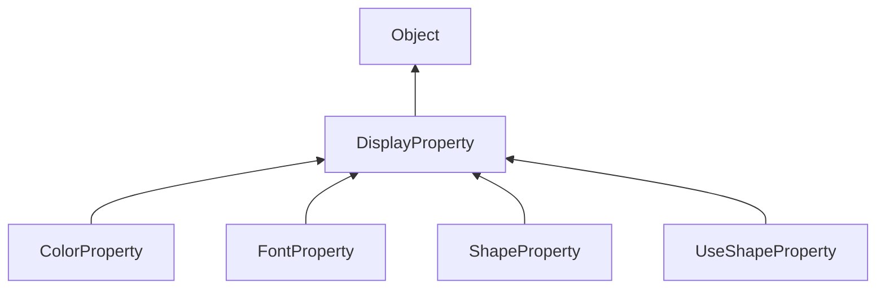

#### Inheritance Graph

```mermaid
graph BT
	DisplayProperty
	DisplayProperty --> Object
	ColorProperty --> DisplayProperty
	FontProperty --> DisplayProperty
	ShapeProperty --> DisplayProperty
	UseShapeProperty --> DisplayProperty
	click DisplayProperty "escript_type_GUI_DisplayProperty"
	click Object "escript_type_Object"
	click ColorProperty "escript_type_GUI_ColorProperty"
	click FontProperty "escript_type_GUI_FontProperty"
	click ShapeProperty "escript_type_GUI_ShapeProperty"
	click UseShapeProperty "escript_type_GUI_UseShapeProperty"
```

