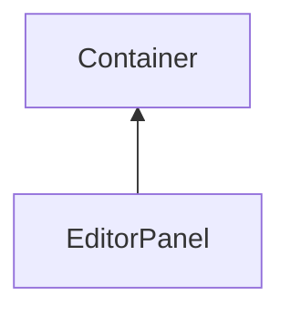

#### Inheritance Graph

## Attributes

|
| ----------: | ---------------------------------------------------------------- | 
| **getData** | [ESMF] Array EditorPanel.getData() (alias for getMarkedChildren) | 
{: .nohead .nowrap1 }

## Functions

|
| ------------------------------------------------------------------------------------------------------------: | --------------------------------------------------------------- | 
| **[getMarkedChildren](classGUI_1_1EditorPanel#classGUI_1_1EditorPanel_1ab7eac24938df943862bf915ac56ab551)**() | [ESMF] Array EditorPanel.getMarkedChildren()                    | 
| **[markChild](classGUI_1_1EditorPanel#classGUI_1_1EditorPanel_1a3a6120629c9a6128db5f071158560080)**(p0)       | [ESMF] self EditorPanel.markChild(Component)                    | 
| **[markingChanged](classGUI_1_1EditorPanel#classGUI_1_1EditorPanel_1ad0fbd6796535960a607e286ddcc608fa)**()    | [ESMF] self EditorPanel.markingChanged()                        | 
| **onDataChanged**(p0)                                                                                         | [ESMF] Bool E_EditorPanel.onDataChanged() \note ObjectAttribute | 
| **[unmarkAll](classGUI_1_1EditorPanel#classGUI_1_1EditorPanel_1a34ad3dda8862194e6a4cae428a8b61fe)**()         | [ESMF] self EditorPanel.unmarkAll()                             | 
| **[unmarkChild](classGUI_1_1EditorPanel#classGUI_1_1EditorPanel_1ab79814b12d58a6077520f3cf1583cedc)**(p0)     | [ESMF] self EditorPanel.unmarkChild(Component)                  | 
{: .nohead .nowrap1 }

