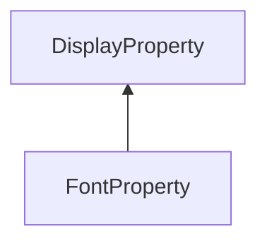

#### Inheritance Graph

## Functions

|
| -----------------------: | ------------------------------------------------ | 
| **_constructor**(p0, p1) | [ESF] new FontProperty(Number id,AbstractFont) ) | 
{: .nohead .nowrap1 }

