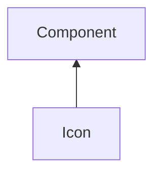

#### Inheritance Graph

## Functions

|
| -------------------------------------------------------------------------------------------: | --------------------------------------------- | 
| **[getImageData](classGUI_1_1Icon#classGUI_1_1Icon_1a79effaba35f0e6dcd8994cb026f7ab6a)**()   | [ESMF] E_Rect Component.getImageData()        | 
| **[getImageRect](classGUI_1_1Icon#classGUI_1_1Icon_1a36ce5741d872f6fa4df0864e6cf3b68f)**()   | [ESMF] E_Rect Component.getImageRect()        | 
| **[setImageData](classGUI_1_1Icon#classGUI_1_1Icon_1a8cc65e06aaa0a3f76db76732cde0bbc4)**(p0) | [ESMF] self Component.setImageData(ImageData) | 
| **[setImageRect](classGUI_1_1Icon#classGUI_1_1Icon_1a23246f7d19c2de2c82026797822ce474)**(p0) | [ESMF] self Component.setImageRect(Util.Rect) | 
{: .nohead .nowrap1 }

