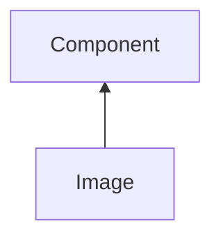

#### Inheritance Graph

## Functions

|
| --------------------------------------------------------------------------------------------------: | ------------------------------------------------------ | 
| **[createPixelAccessor](classGUI_1_1Image#classGUI_1_1Image_1a88744f059e2a8b473a230425127f47ef)**() | [ESMF] PixelAccessor\|Void Image.createPixelAccessor() | 
| **[dataChanged](classGUI_1_1Image#classGUI_1_1Image_1a39e1059b6110fdf736c4913c0406af0b)**()         | [ESMF] self Image.dataChanged()                        | 
| **[getImageData](classGUI_1_1Image#classGUI_1_1Image_1aec6932eb2f9626667b6ff86aa1232b18)**()        | [ESMF] E_Rect Component.getImageData()                 | 
| **getImageHeight**()                                                                                | [ESMF] Number Image.getImageHeight()                   | 
| **getImageWidth**()                                                                                 | [ESMF] Number Image.getImageWidth()                    | 
| **[updateData](classGUI_1_1Image#classGUI_1_1Image_1a79bd0fef4e3d509308753339ed317099)**(p0)        | [ESMF] self Image.updateData(_Bitmap )                 | 
{: .nohead .nowrap1 }

