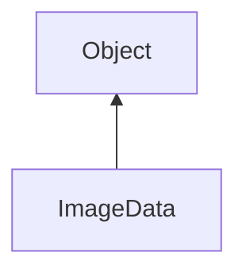

#### Inheritance Graph

## Functions

|
| ----------------------------------------------------------------------------------------------------------: | ---------------------------------------------- | 
| **_constructor**(p0)                                                                                        | [ESF] new ImageData(Util::Bitmap)              | 
| **[createPixelAccessor](classGUI_1_1ImageData#classGUI_1_1ImageData_1a2cd0f7591c1757d79e600da58c079041)**() | [ESMF] RESULT ImageData.createPixelAccessor()  | 
| **[dataChanged](classGUI_1_1ImageData#classGUI_1_1ImageData_1a3f8b7506654efd74044b09eff03c40d1)**()         | [ESMF] self ImageData.dataChanged()            | 
| **[getBitmap](classGUI_1_1ImageData#classGUI_1_1ImageData_1a05860593eee15dfd07ebca7d4cf2b2c8)**()           | [ESMF] RESULT ImageData.getBitmap()            | 
| **[removeGLData](classGUI_1_1ImageData#classGUI_1_1ImageData_1a1cfff2d326a0b306d8348ab4ab49d04a)**()        | [ESMF] self ImageData.removeGLData()           | 
| **[updateData](classGUI_1_1ImageData#classGUI_1_1ImageData_1acc350dde8812d26ca89305dae4dffa50)**(p0)        | [ESMF] self ImageData.updateData(Util::Bitmap) | 
{: .nohead .nowrap1 }

