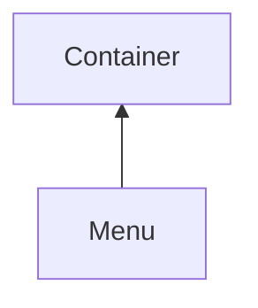

#### Inheritance Graph

## Functions

|
| -----------------------------------------------------------------------------------: | ------------------------------- | 
| **[close](classGUI_1_1Menu#classGUI_1_1Menu_1a7a5694e08013e66d092d33d53ddf96ea)**()  | [ESMF] self Menu.close()        | 
| **[open](classGUI_1_1Menu#classGUI_1_1Menu_1aeec866032eacc6d70d04758450aad0a9)**(p0) | [ESMF] self Menu.open(Vec2 pos) | 
{: .nohead .nowrap1 }

