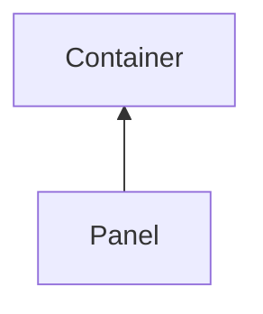

#### Inheritance Graph

## Functions

|
| ------------------------------------------------------------------------------------------------------------------------------: | -------------------------------------------------- | 
| **[disableAutoBreak](classGUI_1_1Panel#classGUI_1_1Panel_1a6d07aadbc0654d1f5b06ac4e2c1c7ba6)**()                                | [ESMF] self Panel.disableAutoBreak()               | 
| **[enableAutoBreak](classGUI_1_1Panel#classGUI_1_1Panel_1a8c5bbe3b9624864e32cc3f8a49679105)**()                                 | [ESMF] self Panel.enableAutoBreak()                | 
| **[getContentContainer](classGUI_1_1ScrollableContainer#classGUI_1_1ScrollableContainer_1a1019b08bb1969a7b755248fb8cbba921)**() | Container Panel.getContentContainer( )             | 
| **[getScrollPos](classGUI_1_1ScrollableContainer#classGUI_1_1ScrollableContainer_1a197900ab0dbd0b829552480c85bad45f)**()        | Vec2 Panel.getScrollPos( )                         | 
| **[nextColumn](classGUI_1_1Panel#classGUI_1_1Panel_1afc718fa5738d3fb5bcf6bea2bb083f82)**([p0])                                  | [ESMF] self Panel.nextColumn(Number)               | 
| **[nextRow](classGUI_1_1Panel#classGUI_1_1Panel_1a7fbc6e7dc47724e11fa03aefcec30ff0)**([p0])                                     | [ESMF] self Panel.nextRow(Number)                  | 
| **[scrollTo](classGUI_1_1ScrollableContainer#classGUI_1_1ScrollableContainer_1ac64b108ec2aae407052990519bc29220)**(p0 [, p1])   | self Panel.scrollTo( Vec2 pos [,Number duration] ) | 
| **[setMargin](classGUI_1_1Panel#classGUI_1_1Panel_1a2f76df5ed9a0bed90e1e924804cdc238)**(p0)                                     | [ESMF] self Panel.setMargin(Number)                | 
| **[setPadding](classGUI_1_1Panel#classGUI_1_1Panel_1a2df758d6cd63b4047dc281f50f22b158)**(p0)                                    | [ESMF] self Panel.setPadding(Number)               | 
{: .nohead .nowrap1 }

