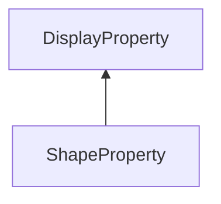

#### Inheritance Graph

## Functions

|
| ---------------------------------------------------------------------------------------------------------: | ---------------------------------------- | 
| **_constructor**(p0, p1)                                                                                   | [ESF] new ShapeProperty(Number id,Shape) | 
| **[getShape](classGUI_1_1ShapeProperty#classGUI_1_1ShapeProperty_1a406cf5b04dc0fe68675ef25da9e81b86)**()   | [ESF] Shape ShapeProperty.getShape()     | 
| **[setShape](classGUI_1_1ShapeProperty#classGUI_1_1ShapeProperty_1aed29380e8c97b978fc20504e1db9f197)**(p0) | [ESF] self ShapeProperty.setShape(Shape) | 
{: .nohead .nowrap1 }

