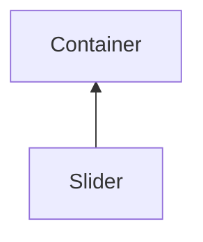

#### Inheritance Graph

## Attributes

|
| ----------: | ------------------------------------------------------- | 
| **getData** | [ESMF] number Slider.getData() (alias for getValue)     | 
| **setData** | [ESMF] self Slider.setData(number) (alias for setValue) | 
{: .nohead .nowrap1 }

## Functions

|
| ---------------------------------------------------------------------------------------------------: | ------------------------------------------------------------------ | 
| **[getValue](classGUI_1_1Slider#classGUI_1_1Slider_1a03a96e27e34c7cfc644c8c665268dfd2)**()           | [ESMF] number Slider.getValue()                                    | 
| **onDataChanged**(p0)                                                                                | [ESMF] Bool Slider.onDataChanged() \note ObjectAttribute           | 
| **[setRange](classGUI_1_1Slider#classGUI_1_1Slider_1a46f7deac54910fb4a2c842c7be814b92)**(p0, p1, p2) | [ESMF] self Slider.setRange(number left,number right,number steps) | 
| **[setValue](classGUI_1_1Slider#classGUI_1_1Slider_1ac4cb2572fe8652c91e98f0bfec2b6758)**(p0)         | [ESMF] self Slider.setValue(number)                                | 
{: .nohead .nowrap1 }

