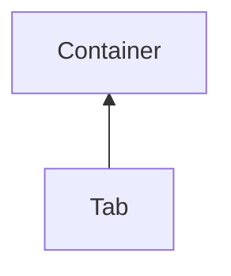

#### Inheritance Graph

## Functions

|
| -------------------------------------------------------------------------------------------------------------------: | -------------------------------- | 
| **[getTitle](classGUI_1_1TabbedPanel_1_1Tab#classGUI_1_1TabbedPanel_1_1Tab_1ae792d68dceb01173b5aa0d5c6ea35d7c)**()   | [ESMF] string Tab.getTitle()     | 
| **[setTitle](classGUI_1_1TabbedPanel_1_1Tab#classGUI_1_1TabbedPanel_1_1Tab_1a80948786ec1e75682f24fe5b5d8c65a4)**(p0) | [ESMF] self Tab.setTitle(string) | 
{: .nohead .nowrap1 }

