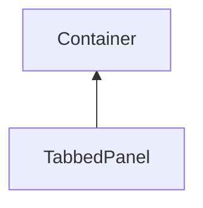

#### Inheritance Graph

## Functions

|
| --------------------------------------------------------------------------------------------------------------: | ------------------------------------------------------------------ | 
| ~~addTab~~(p0, p1)                                                                                              | [ESMF] Tab TabbedPanel.addTab(string title,con) **Deprecated** | 
| **[createTab](classGUI_1_1TabbedPanel#classGUI_1_1TabbedPanel_1ac7d8f45b62688f1184a51a8ca285dfaa)**(p0)         | [ESMF] Tab TabbedPanel.createTab(string title)                     | 
| **[getActiveTabIndex](classGUI_1_1TabbedPanel#classGUI_1_1TabbedPanel_1a916adcdd13f2740f5afb38c2dd4ec5ce)**()   | [ESMF] Number TabbedPanel.getActiveTabIndex()                      | 
| **[setActiveTabIndex](classGUI_1_1TabbedPanel#classGUI_1_1TabbedPanel_1a915852bebb1bdbc35402968b1b3ee5b5)**(p0) | [ESMF] self TabbedPanel.setActiveTabIndex(Number)                  | 
{: .nohead .nowrap1 }

