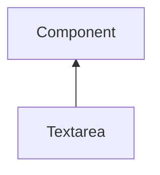

#### Inheritance Graph

## Attributes

|
| ----------: | -------------------------------------------------------- | 
| **getData** | [ESMF] string Textarea.getData() (alias for getText)     | 
| **setData** | [ESMF] self Textarea.setData(string) (alias for setText) | 
{: .nohead .nowrap1 }

## Functions

|
| ----------------------------------------------------------------------------------------------: | ---------------------------------------------------------- | 
| **[getText](classGUI_1_1Textarea#classGUI_1_1Textarea_1aa807c6ac5f6650c8e03c71ee43d3c5ab)**()   | [ESMF] string Textarea.getText()                           | 
| **onDataChanged**(p0)                                                                           | [ESMF] Bool Textarea.onDataChanged() \note ObjectAttribute | 
| **[setText](classGUI_1_1Textarea#classGUI_1_1Textarea_1ac7646884c3ec5cb51a0a5c8373f450db)**(p0) | [ESMF] self Textarea.setText(string)                       | 
{: .nohead .nowrap1 }

