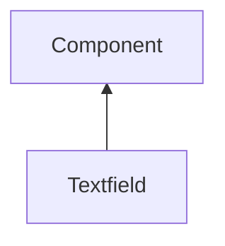

#### Inheritance Graph

## Attributes

|
| ----------: | --------------------------------------------------------- | 
| **getData** | [ESMF] string Textfield.getData() (alias for getText)     | 
| **setData** | [ESMF] self Textfield.setData(string) (alias for setText) | 
{: .nohead .nowrap1 }

## Functions

|
| --------------------------------------------------------------------------------------------------------------: | ----------------------------------------------------------- | 
| **[addOption](classGUI_1_1Textfield#classGUI_1_1Textfield_1ab3d257064f80ceba73a8e1d1702888b2)**(p0)             | [ESMF] self Textfield.addOption(option)                     | 
| **addOptions**(p0)                                                                                              | [ESMF] self Textfield.addOptions(Array options)             | 
| **[clearOptions](classGUI_1_1Textfield#classGUI_1_1Textfield_1a542b04be9bc42aa0c018279b07854c59)**()            | [ESMF] self Textfield.clearOptions()                        | 
| **[countOptions](classGUI_1_1Textfield#classGUI_1_1Textfield_1a92bbd7d654ce7e09dfa887b11db7cbe8)**()            | [ESMF] number Textfield.countOptions()                      | 
| **[getCurrentOptionIndex](classGUI_1_1Textfield#classGUI_1_1Textfield_1a6450abeff9a6bf3ced28ec32dfe7b7cd)**()   | [ESMF] number Textfield.getCurrentOptionIndex()             | 
| **[getOption](classGUI_1_1Textfield#classGUI_1_1Textfield_1a87dfa91e9308d97e6d5007ba6f68e03e)**(p0)             | [ESMF] string Textfield.getOption(nr)                       | 
| **[getText](classGUI_1_1Textfield#classGUI_1_1Textfield_1aa32f107605620992a4ab0883803fdf8b)**()                 | [ESMF] string Textfield.getText()                           | 
| **[hasOptions](classGUI_1_1Textfield#classGUI_1_1Textfield_1ab4e903206b519d4206452cdeb89b0c47)**()              | [ESMF] bool Textfield.hasOptions()                          | 
| **onDataChanged**(p0)                                                                                           | [ESMF] Bool Textfield.onDataChanged() \note ObjectAttribute | 
| **[setCurrentOptionIndex](classGUI_1_1Textfield#classGUI_1_1Textfield_1a0637290a9c435a7a8082dc2dc851f209)**(p0) | [ESMF] self Textfield.setCurrentOptionIndex(number)         | 
| **[setText](classGUI_1_1Textfield#classGUI_1_1Textfield_1acf80ebc27c2a3fbdc50146d2b4bb326e)**(p0)               | [ESMF] self Textfield.setText(string)                       | 
{: .nohead .nowrap1 }

