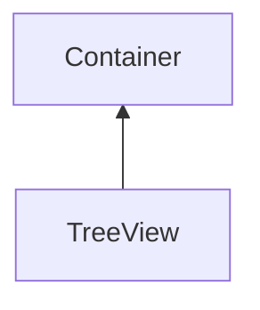

#### Inheritance Graph

## Attributes

|
| ----------: | -- | 
| **getData** |  | 
{: .nohead .nowrap1 }

## Functions

|
| --------------------------------------------------------------------------------------------------------: | ---------------------------------------------------------- | 
| **[getMarkedComponents](classGUI_1_1TreeView#classGUI_1_1TreeView_1a9e9913a164f924fbde7e6c9894b9d127)**() | [ESMF] Array TreeView.getMarkedComponents()                | 
| **[getRootEntry](classGUI_1_1TreeView#classGUI_1_1TreeView_1a4abccbf1ea79aa7458d767d11e295ee2)**()        | [ESMF] TreeViewEntry TreeView.getRootEntry()               | 
| **[markComponent](classGUI_1_1TreeView#classGUI_1_1TreeView_1a7f2c491852fa541772c8d7ca86006594)**(p0)     | [ESMF] self TreeView.markComponent(Component)              | 
| **[markEntry](classGUI_1_1TreeView#classGUI_1_1TreeView_1acd78a02599fbda3188e9266b04e6377c)**(p0)         | [ESMF] self TreeView.markEntry(TreeViewEntry)              | 
| **onDataChanged**(p0)                                                                                     | [ESMF] Bool TreeView.onDataChanged() \note ObjectAttribute | 
| **[unmarkAll](classGUI_1_1TreeView#classGUI_1_1TreeView_1a755db9e1f52d6e77d916b55b220c1dc2)**()           | [ESMF] self TreeView.unmarkAll()                           | 
| **[unmarkComponent](classGUI_1_1TreeView#classGUI_1_1TreeView_1a667bbcfabd989b40005f5e3f92cd0a2d)**(p0)   | [ESMF] self TreeView.unmarkComponent(Component)            | 
| **[unmarkEntry](classGUI_1_1TreeView#classGUI_1_1TreeView_1aa5eb1fad6a0d77c93f374e5cefcf7606)**(p0)       | [ESMF] self TreeView.unmarkEntry(TreeViewEntry)            | 
{: .nohead .nowrap1 }

