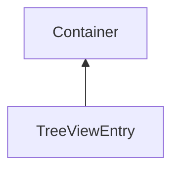

#### Inheritance Graph

## Functions

|
| ---------------------------------------------------------------------------------------------------------------------------------------: | ------------------------------------------------------ | 
| **[collapse](classGUI_1_1TreeView_1_1TreeViewEntry#classGUI_1_1TreeView_1_1TreeViewEntry_1a9c2b923595624c04c7643c178d034938)**()         | [ESMF] self TreeViewEntry.collapse()                   | 
| **[getFirstSubentry](classGUI_1_1TreeView_1_1TreeViewEntry#classGUI_1_1TreeView_1_1TreeViewEntry_1a85762ac0a80b6c79c3a3cc524d4e7daa)**() | [ESMF] TreeViewEntry\|void TreeView.getFirstSubentry() | 
| **[isCollapsed](classGUI_1_1TreeView_1_1TreeViewEntry#classGUI_1_1TreeView_1_1TreeViewEntry_1a8342f001a0def760bf2dedcca5aa6f7f)**()      | [ESMF] bool TreeViewEntry.isCollapsed()                | 
| **[isMarked](classGUI_1_1TreeView_1_1TreeViewEntry#classGUI_1_1TreeView_1_1TreeViewEntry_1a93d392a733b2240be3b321b6ec793df3)**()         | [ESMF] bool TreeViewEntry.isMarked()                   | 
| **[open](classGUI_1_1TreeView_1_1TreeViewEntry#classGUI_1_1TreeView_1_1TreeViewEntry_1a4c1cfd9cc8623e9ae68c909caf004a15)**()             | [ESMF] self TreeViewEntry.open()                       | 
| **[setComponent](classGUI_1_1TreeView_1_1TreeViewEntry#classGUI_1_1TreeView_1_1TreeViewEntry_1a9257a8e9b305c3712f8907a855b910da)**(p0)   | [ESMF] self TreeViewEntry.setComponent(Component)      | 
{: .nohead .nowrap1 }

