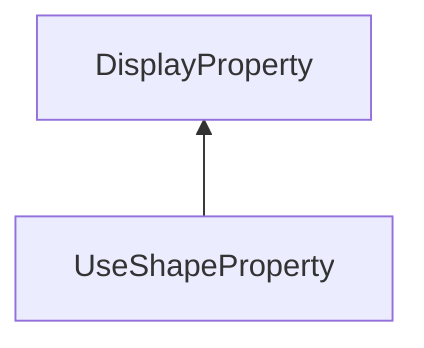

#### Inheritance Graph

## Functions

|
| -----------------------: | ---------------------------------------------- | 
| **_constructor**(p0, p1) | [ESF] new ColorProperty(Number id1,Number id2) | 
{: .nohead .nowrap1 }

