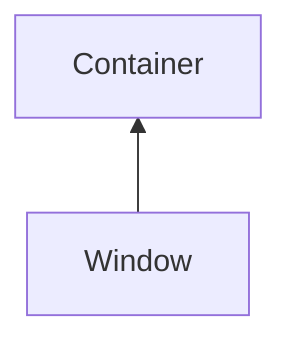

#### Inheritance Graph

## Functions

|
| -------------------------------------------------------------------------------------------: | --------------------------------------------- | 
| **[close](classGUI_1_1Window#classGUI_1_1Window_1a5a1f10718de3707d436aa84d8e36d842)**()      | [ESMF] self Window.close()                    | 
| **[getHeader](classGUI_1_1Window#classGUI_1_1Window_1a8c3ecfcf8cca20bb4125240d7c323eee)**()  | [ESMF] string Window.getHeader()              | 
| **[getLogo](classGUI_1_1Window#classGUI_1_1Window_1a2a174ac014c0482f1f5dda87772e4ac1)**()    | [ESMF] string Window.getLogo()                | 
| **[getTitle](classGUI_1_1Window#classGUI_1_1Window_1a336ac64803d963c50e1df0755a71ba02)**()   | [ESMF] string Window.getTitle()               | 
| **[minimize](classGUI_1_1Window#classGUI_1_1Window_1a46cce52a1950f113e752fa7f6b5895ba)**()   | [ESMF] self Window.minimize( )                | 
| **[restore](classGUI_1_1Window#classGUI_1_1Window_1a07e6816fb015d5da88025e94d8172422)**()    | [ESMF] self Window.restore( )                 | 
| **[setLogo](classGUI_1_1Window#classGUI_1_1Window_1a11f36990b41f4a2611bd92a058ed1b86)**(p0)  | [ESMF] self Window.setLogo( Component\|Void ) | 
| **[setTitle](classGUI_1_1Window#classGUI_1_1Window_1aa93d613ef85b5e4b3d9dd17cf2d13da5)**(p0) | [ESMF] self Window.setTitle(string)           | 
{: .nohead .nowrap1 }

