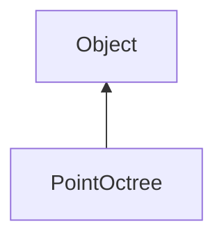

#### Inheritance Graph

## Functions

|
| --------------------------------------------------------------------------------------------------------------------------------: | -------------------------------------------------------------------------------------------------------------- | 
| **_constructor**(p0, p1, p2)                                                                                                      | [ESF] PointOctree new PointOctree( const Box & boundingBox, float minimumBoxSize, unsigned int maximumPoints ) | 
| **[clear](classGeometry_1_1PointOctree#classGeometry_1_1PointOctree_1a45103ec62541537adfca57533b3535d4)**()                       | [ESMF] self PointOctree.clear()                                                                                | 
| **[collectPoints](classGeometry_1_1PointOctree#classGeometry_1_1PointOctree_1ac69fbddf1af554c66771dfe5a07aa1d4)**()               | [ESMF] Array PointOctree.collectPoints()                                                                       | 
| **[collectPointsWithinBox](classGeometry_1_1PointOctree#classGeometry_1_1PointOctree_1a72f38d775c07e0571f4c4e378b4ad954)**(p0)    | [ESMF] Array PointOctree.collectPointsWithinBox(Box)                                                           | 
| **[collectPointsWithinSphere](classGeometry_1_1PointOctree#classGeometry_1_1PointOctree_1a97944c571dfb93573824ab3da35d8117)**(p0) | [ESMF] Array PointOctree.collectPointsWithinSphere(Sphere)                                                     | 
| **[getBox](classGeometry_1_1PointOctree#classGeometry_1_1PointOctree_1a6d4a62e0ffdaeaa952b532e04b966d5b)**()                      | [ESMF] Box PointOctree.getBox()                                                                                | 
| **[getClosestPoints](classGeometry_1_1PointOctree#classGeometry_1_1PointOctree_1a912f9963c91c5b82159d91dbfa5e683d)**(p0, p1)      | [ESMF] Array PointOctree.getClosestPoints(Vec3 center, int count)                                              | 
| **[insert](classGeometry_1_1PointOctree#classGeometry_1_1PointOctree_1a3ceab8668ca582afdb44f45d4f56b009)**(p0, p1)                | [ESMF] self PointOctree.insert(Vec3 pos, Object data)                                                          | 
{: .nohead .nowrap1 }

