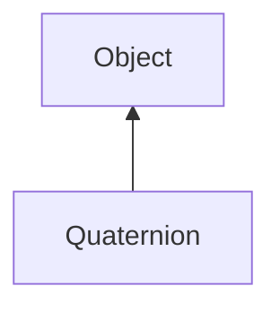

#### Inheritance Graph

## Functions

|
| -----------------------------------------------------------------------------------------------------------------------: | --------------------------------------------------------------------------------------- | 
| **\***(p0)                                                                                                               | [ESMF] E_Quaternion E_Quaternion.\*(number)                                             | 
| **\*=**(p0)                                                                                                              | [ESMF] E_Quaternion E_Quaternion.\*=(Number)                                            | 
| **/**(p0)                                                                                                                | [ESMF] E_Quaternion E_Quaternion./(number)                                              | 
| **/=**(p0)                                                                                                               | [ESMF] E_Quaternion E_Quaternion./=(Number)                                             | 
| **_constructor**([p0 [, p1 [, p2 [, p3]]]])                                                                              | [ESMF] Quaternion new Quaternion([ x,y,z,w \| Quaternion \| Mat3x3\|  Array(x,y,z,w) ]) | 
| **[conjugate](classGeometry_1_1Quaternion#classGeometry_1_1Quaternion_1aceb28d990107c3ac41a2359819cc270c)**()            | [ESMF] E_Quaternion E_Quaternion.conjugate()                                            | 
| **[dot](classGeometry_1_1Quaternion#classGeometry_1_1Quaternion_1af3133d323632336c6604f5e1a1603e0a)**(p0)                | [ESMF] Number E_Quaternion.dot(Quaternion)                                              | 
| **[eulerToQuaternion](classGeometry_1_1Quaternion#classGeometry_1_1Quaternion_1a46f6327db32eadc1f0971c2413ff92d8)**(p0)  | [ESF] (static) E_Quaternion eulerToQuaternion(Vec3)                                     | 
| **getW**()                                                                                                               | [ESMF] number E_Quaternion.getW()                                                       | 
| **getX**()                                                                                                               | [ESMF] number E_Quaternion.getX()                                                       | 
| **getY**()                                                                                                               | [ESMF] number E_Quaternion.getY()                                                       | 
| **getZ**()                                                                                                               | [ESMF] number E_Quaternion.getZ()                                                       | 
| **[inverse](classGeometry_1_1Quaternion#classGeometry_1_1Quaternion_1a9a0c6f291c667f35156fe85ecb8d2157)**()              | [ESMF] E_Quaternion E_Quaternion.inverse()                                              | 
| **[length](classGeometry_1_1Quaternion#classGeometry_1_1Quaternion_1a0d728c188b01601fcabdff7b981e38b3)**()               | [ESMF] number E_Quaternion.length()                                                     | 
| **[lerp](classGeometry_1_1Quaternion#classGeometry_1_1Quaternion_1aceb932c23f3d4beece0f92132e27d894)**(p0, p1, p2)       | [ESF] (static) E_Quaternion lerp(Quaternion, Quaternion, float)                         | 
| **makeRotate**(p0, p1 [, p2 [, p3]])                                                                                     | [ESMF] self E_Quaternion.makeRotate(deg, (Vec3 axis \| x,y,z) )                         | 
| **[matrixToQuaternion](classGeometry_1_1Quaternion#classGeometry_1_1Quaternion_1a62e77a609deea077fbdacf116a0224c3)**(p0) | [ESF] (static) E_Quaternion matrixToQuaternion(Matrix3x3)                               | 
| **[normalize](classGeometry_1_1Quaternion#classGeometry_1_1Quaternion_1a4a33b0303ac6afc54fcba293e866243e)**()            | [ESMF] self E_Quaternion.normalize()                                                    | 
| **setW**(p0)                                                                                                             | [ESMF] self E_Quaternion.setW(Number)                                                   | 
| **setX**(p0)                                                                                                             | [ESMF] self E_Quaternion.setX(Number)                                                   | 
| **setY**(p0)                                                                                                             | [ESMF] self E_Quaternion.setY(Number)                                                   | 
| **setZ**(p0)                                                                                                             | [ESMF] self E_Quaternion.setZ(Number)                                                   | 
| **[slerp](classGeometry_1_1Quaternion#classGeometry_1_1Quaternion_1a130e4643285d70bea19031bd8b27a57c)**(p0, p1, p2)      | [ESF] (static) E_Quaternion slerp(Quaternion, Quaternion, float)                        | 
| **toArray**()                                                                                                            | [ESMF] Array E_Quaternion.toArray()                                                     | 
| **[toEuler](classGeometry_1_1Quaternion#classGeometry_1_1Quaternion_1ada2afd75aa55c69a13e48db96a72c3ce)**()              | [ESMF] E_Vec3 E_Quaternion.toEuler()                                                    | 
| **[toMatrix](classGeometry_1_1Quaternion#classGeometry_1_1Quaternion_1af8fd8afaa57e5a63c01543506b04ad56)**()             | [ESMF] E_Matrix3x3 E_Quaternion.toMatrix()                                              | 
{: .nohead .nowrap1 }

