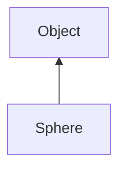

#### Inheritance Graph

## Functions

|
| ----------------------------------------------------------------------------------------------------------------------------------------------: | -------------------------------------------------------------------------- | 
| **_constructor**([p0 [, p1]])                                                                                                                   | [ESMF] Sphere new Sphere([\| Vec3 center, Number radius \| Sphere source]) | 
| **[calcCartesianCoordinate](classGeometry_1_1%5F%5FSphere#classGeometry_1_1%5F%5FSphere_1abc562a9656a192b59885e8a018511727)**(p0, p1)           | [ESMF] Vec3 Sphere.calcCartesianCoordinate(Number, Number)                 | 
| **[calcCartesianCoordinateUnitSphere](classGeometry_1_1%5F%5FSphere#classGeometry_1_1%5F%5FSphere_1adb552c5c03016c7d10ece2d8e9044ae2)**(p0, p1) | [ESF] Vec3 Sphere.calcCartesianCoordinateUnitSphere(Number, Number)        | 
| **[distance](classGeometry_1_1%5F%5FSphere#classGeometry_1_1%5F%5FSphere_1a3684e2102a70642f2926dcbe71c49188)**(p0)                              | [ESMF] Number Sphere.distance(Vec3)                                        | 
| **[getRadius](classGeometry_1_1%5F%5FSphere#classGeometry_1_1%5F%5FSphere_1ad6ebf0e5303c58fb42fa43999024a354)**()                               | [ESMF] Number Sphere.getRadius()                                           | 
| **[isOutside](classGeometry_1_1%5F%5FSphere#classGeometry_1_1%5F%5FSphere_1a4e5963335c66be02d8b1ee4ebb6d0513)**(p0)                             | [ESMF] Bool Sphere.isOutside(Vec3)                                         | 
| **[setRadius](classGeometry_1_1%5F%5FSphere#classGeometry_1_1%5F%5FSphere_1a176ea1c25b376a4eb893c3bfbbbfb75d)**(p0)                             | [ESMF] self Sphere.setRadius(Vec3)                                         | 
{: .nohead .nowrap1 }

## Information

|
| ----------------------------------------------------------------------------------------------------------------: | ------------------------------ | 
| **[getCenter](classGeometry_1_1%5F%5FSphere#classGeometry_1_1%5F%5FSphere_1ab0195202450192ec0444b538d837829d)**() | [ESMF] Vec3 Sphere.getCenter() | 
{: .nohead .nowrap1 }

## Modification

|
| ------------------------------------------------------------------------------------------------------------------: | ---------------------------------- | 
| **[setCenter](classGeometry_1_1%5F%5FSphere#classGeometry_1_1%5F%5FSphere_1a963fae7d7c4b171caf1229633fcb92f2)**(p0) | [ESMF] self Sphere.setCenter(Vec3) | 
{: .nohead .nowrap1 }

