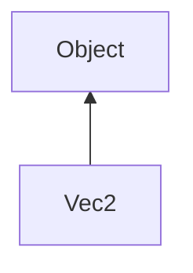

#### Inheritance Graph

## Functions

|
| ----------------------------------------------------------------------------------------------------------------------: | ------------------------------------------------------------ | 
| **\***(p0)                                                                                                              | [ESMF] E_Vec2 E_Vec2.\*(number)                              | 
| **\*=**(p0)                                                                                                             | [ESMF] E_Vec2 E_Vec2.\*=(Number)                             | 
| **+**(p0)                                                                                                               | [ESMF] E_Vec2 E_Vec2.+(E_Vec2)                               | 
| **+=**(p0)                                                                                                              | [ESMF] E_Vec2 E_Vec2.+=(E_Vec2)                              | 
| **-**(p0)                                                                                                               | [ESMF] E_Vec2 E_Vec2.-(E_Vec2)                               | 
| **-=**(p0)                                                                                                              | [ESMF] E_Vec2 E_Vec2.-=(E_Vec2)                              | 
| **/**(p0)                                                                                                               | [ESMF] E_Vec2 E_Vec2./(number)                               | 
| **/=**(p0)                                                                                                              | [ESMF] E_Vec2 E_Vec2./=(Number)                              | 
| **_-_pre**()                                                                                                            | [ESMF] E_Vec2 -E_Vec2()                                      | 
| **_constructor**([p0 [, p1]])                                                                                           | [ESMF] Vec2 new Vec2([ x,y \| Vec2])                         | 
| **_get**(p0)                                                                                                            | [ESMF] Number Vec2[key]                                      | 
| **_set**(p0, p1)                                                                                                        | [ESMF] thisObj Vec2[key] = Number                            | 
| **[distance](classGeometry_1_1%5F%5FVec2#classGeometry_1_1%5F%5FVec2_1aafc3650b65c2414b5c9045f0aae86a90)**(p0)          | [ESMF] Number E_Vec2.distance(E_Vec2)                        | 
| **[dot](classGeometry_1_1%5F%5FVec2#classGeometry_1_1%5F%5FVec2_1a57fd6463ab37015754ebb20a79503acd)**(p0)               | [ESMF] Number E_Vec2.dot(E_Vec2)                             | 
| **[getX](classGeometry_1_1%5F%5FVec2#classGeometry_1_1%5F%5FVec2_1a7392eebd92f1b5d53b9675d03fa1df0b)**()                | [ESMF] number E_Vec2.getX()                                  | 
| **[getY](classGeometry_1_1%5F%5FVec2#classGeometry_1_1%5F%5FVec2_1a442ab626805e23c6a3e8495cbd1a316f)**()                | [ESMF] number E_Vec2.getY()                                  | 
| **[isZero](classGeometry_1_1%5F%5FVec2#classGeometry_1_1%5F%5FVec2_1afebf4f7df907cbbdcf7245faeb05f3bb)**()              | [ESMF] bool E_Vec2.isZero()                                  | 
| **[length](classGeometry_1_1%5F%5FVec2#classGeometry_1_1%5F%5FVec2_1a4a2e248f8175b4470aac3a6533bb36f7)**()              | [ESMF] number E_Vec2.length()                                | 
| **[normalize](classGeometry_1_1%5F%5FVec2#classGeometry_1_1%5F%5FVec2_1a4bd4fead7c36a5b58c38739259846b52)**()           | [ESMF] self E_Vec2.normalize()                               | 
| **[setValue](classGeometry_1_1%5F%5FVec2#classGeometry_1_1%5F%5FVec2_1ac15af89d77e64a980d2fe83d3a1352b8)**([p0 [, p1]]) | [ESMF] self E_Vec2.setValue( Number,Number \| Array \| Vec2) | 
| **[setX](classGeometry_1_1%5F%5FVec2#classGeometry_1_1%5F%5FVec2_1ae8e8fa822ecf32799667eb1d20545b4e)**(p0)              | [ESMF] self E_Vec2.setX(number)                              | 
| **[setY](classGeometry_1_1%5F%5FVec2#classGeometry_1_1%5F%5FVec2_1a9e33605ec605798898cae4e25324e79e)**(p0)              | [ESMF] self E_Vec2.setY(number)                              | 
| **toArray**()                                                                                                           | [ESMF] Array E_Vec2.toArray()                                | 
| **x**([p0])                                                                                                             | [ESMF] Number\|self E_Vec2.x([value])                        | 
| **y**([p0])                                                                                                             | [ESMF] Number\|self E_Vec2.y([value])                        | 
{: .nohead .nowrap1 }

