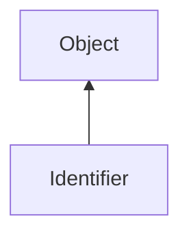

#### Inheritance Graph

## Functions

|
| -------------------: | ------------------------------------------ | 
| **_constructor**(p0) | [ESMF] Identifier new Identifier( string ) | 
{: .nohead .nowrap1 }

